# Section 2 Overview

Section 2 introduces you to Continuous Probability.

After completing Section 2, you will:

-   understand the differences between calculating probabilities for discrete and continuous data.

-   be able to use cumulative distribution functions to assign probabilities to intervals when dealing with continuous data.

-   be able to use R to generate normally distributed outcomes for use in Monte Carlo simulations.

-   know some of the useful theoretical continuous distributions in addition to the normal distribution, such as the student-t, chi-squared, exponential, gamma, beta, and beta-binomial distributions.

# 2.1 Continuous Probability

## Continuous Probability

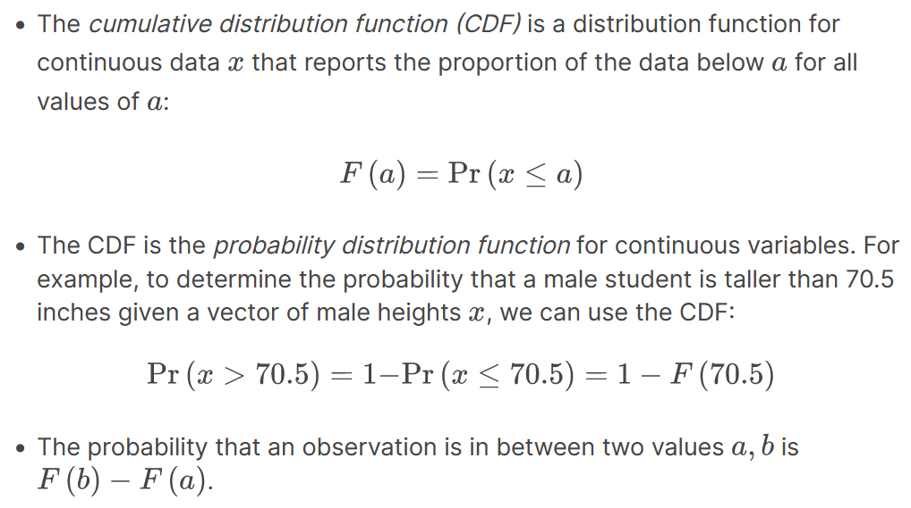

### Code: Cumulative distribution function

Define `x` as male heights from the **dslabs** `heights` dataset:

```{r}
library(tidyverse)
library(dslabs)
data(heights)
x <- heights %>% filter(sex=="Male") %>% pull(height)
```

Given a vector **`x`**, we can define a function for computing the CDF of **`x`** using:

```{r}
F <- function(a) mean(x <= a)
1 - F(70)    # probability of male taller than 70 inches
```

## Theoretical Distribution

### Code: Using `pnorm()` to calculate probabilities

Given male heights `x`:

```{r}
library(tidyverse)
library(dslabs)
data(heights)
x <- heights %>% filter(sex=="Male") %>% pull(height)
```

We can estimate the probability that a male is taller than 70.5 inches using:

```{r}
1 - pnorm(70.5, mean(x), sd(x))
```

### Code: Discretization and the normal approximation

```{r}
# plot distribution of exact heights in data
plot(prop.table(table(x)), xlab = "a = Height in inches", ylab = "Pr(x = a)")

# probabilities in actual data over length 1 ranges containing an integer
mean(x <= 68.5) - mean(x <= 67.5)
mean(x <= 69.5) - mean(x <= 68.5)
mean(x <= 70.5) - mean(x <= 69.5)

# probabilities in normal approximation match well
pnorm(68.5, mean(x), sd(x)) - pnorm(67.5, mean(x), sd(x))
pnorm(69.5, mean(x), sd(x)) - pnorm(68.5, mean(x), sd(x))
pnorm(70.5, mean(x), sd(x)) - pnorm(69.5, mean(x), sd(x))

# probabilities in actual data over other ranges don't match normal approx as well
mean(x <= 70.9) - mean(x <= 70.1)
pnorm(70.9, mean(x), sd(x)) - pnorm(70.1, mean(x), sd(x))
```

## Probability Density

### 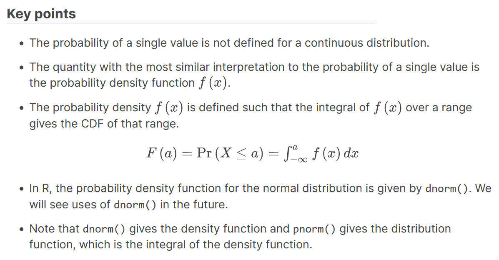

```{r}
avg <- mean(x)
s <- sd(x)
1 - pnorm(76, avg, s)
```

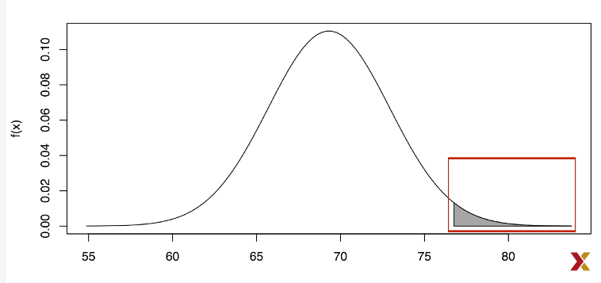

The curve is the probability density function for the normal distribution.

## Plotting the Probability Density

### Plotting the probability density for the normal distribution

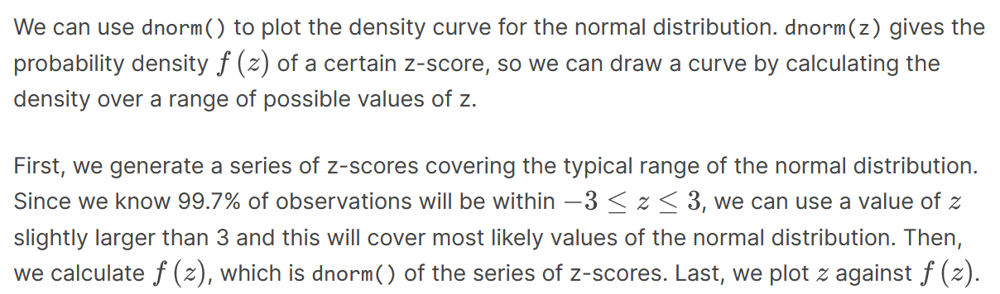

We can use `dnorm()` to plot the density curve for the normal distribution. `dnorm(z)` gives the probability density of a certain z-score, so we can draw a curve by calculating the density over a range of possible values of z.

First, we generate a series of z-scores covering the typical range of the normal distribution. Since we know 99.7% of observations will be within , we can use a value of slightly larger than 3 and this will cover most likely values of the normal distribution. Then, we calculate , which is `dnorm()` of the series of z-scores. Last, we plot against .

```{r}
library(tidyverse)
x <- seq(-4, 4, length = 100)
data.frame(x, f = dnorm(x)) %>%
    ggplot(aes(x, f)) +
    geom_line()
```

Here is the resulting plot:

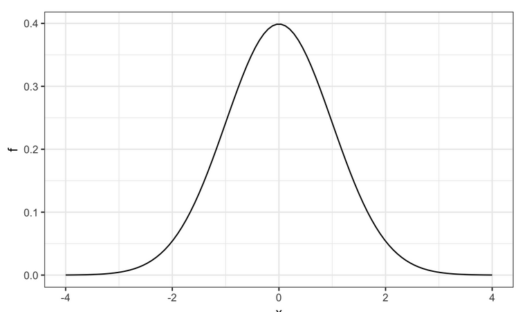

Note that `dnorm()` gives densities for the standard normal distribution by default. Probabilities for alternative normal distributions with mean `mu` and standard deviation `sigma` can be evaluated with:

```{r}
dnorm(z, mu, sigma)
```

## Monte Carlo Simulations

### Monte Carlo Simulations

`rnorm(n, avg, s)` generates `n` random numbers from the normal distribution with average `avg` and standard deviation `s`.

By generating random numbers from the normal distribution, we can simulate height data with similar properties to our dataset. Here we generate simulated height data using the normal distribution.

### Code: Generating normally distributed random numbers

```{r}
# define x as male heights from dslabs data
library(tidyverse)
library(dslabs)
data(heights)
x <- heights %>% filter(sex=="Male") %>% pull(height)

# generate simulated height data using normal distribution - both datasets should have n observations
n <- length(x)
avg <- mean(x)
s <- sd(x)
simulated_heights <- rnorm(n, avg, s)

# plot distribution of simulated_heights
data.frame(simulated_heights = simulated_heights) %>%
    ggplot(aes(simulated_heights)) +
    geom_histogram(color="black", binwidth = 2)
```

### Code: Monte Carlo simulation of tallest person over 7 feet

```{r}
B <- 10000
tallest <- replicate(B, {
    simulated_data <- rnorm(800, avg, s)    # generate 800 normally distributed random heights
    max(simulated_data)    # determine the tallest height
})
mean(tallest >= 7*12)    # proportion of times that tallest person exceeded 7 feet (84 inches)
```

## Other continuous distributions

-   You may encounter other continuous distributions (Student t, chi-squared, exponential, gamma, beta, etc.).

-   R provides functions for density (`d`), quantile (`q`), probability distribution (`p`) and random number generation (`r`) for many of these distributions.

-   Each distribution has a matching abbreviation (for example, `norm()` or `t()`) that is paired with the related function abbreviations (**`d`**`, p, q, r`) to create appropriate functions.

-   For example, use `rt()` to generate random numbers for a Monte Carlo simulation using the Student t distribution.

### Code: Plotting the normal distribution with dnorm

Use d to plot the density function of a continuous distribution. Here is the density function for the normal distribution (abbreviation `norm()`):

```{r}
x <- seq(-4, 4, length.out = 100)
data.frame(x, f = dnorm(x)) %>%
    ggplot(aes(x,f)) +
    geom_line()
```

# Section 3 Overview

Section 3 introduces you to Random Variables, Sampling Models, and the Central Limit Theorem.

Section 3 is divided into two parts:

1.  Random Variables and Sampling Models

2.  The Central Limit Theorem.

After completing Section 3, you will:

-   understand what random variables are, how to generate them, and the correct mathematical notation to use with them.

-   be able to use sampling models to estimate characteristics of a larger population.

-   be able to explain the difference between a distribution and a probability distribution.

-   understand the Central Limit Theorem and the law of large numbers.

There are 2 assignments that use the DataCamp platform for you to practice your coding skills as well as a set of questions on the edX platform at the end of Section 3.

# 3.1 Random Variables and Sampling Models

### Random Variables

-   Random variables are numeric outcomes resulting from random processes.

-   Statistical inference offers a framework for quantifying uncertainty due to randomness.

### Code: Modeling a random variable

```{r}
# define random variable x to be 1 if blue, 0 otherwise
beads <- rep(c("red", "blue"), times = c(2, 3))
x <- ifelse(sample(beads, 1) == "blue", 1, 0)

# demonstrate that the random variable is different every time
ifelse(sample(beads, 1) == "blue", 1, 0)
ifelse(sample(beads, 1) == "blue", 1, 0)
ifelse(sample(beads, 1) == "blue", 1, 0)
```

### Sampling Models

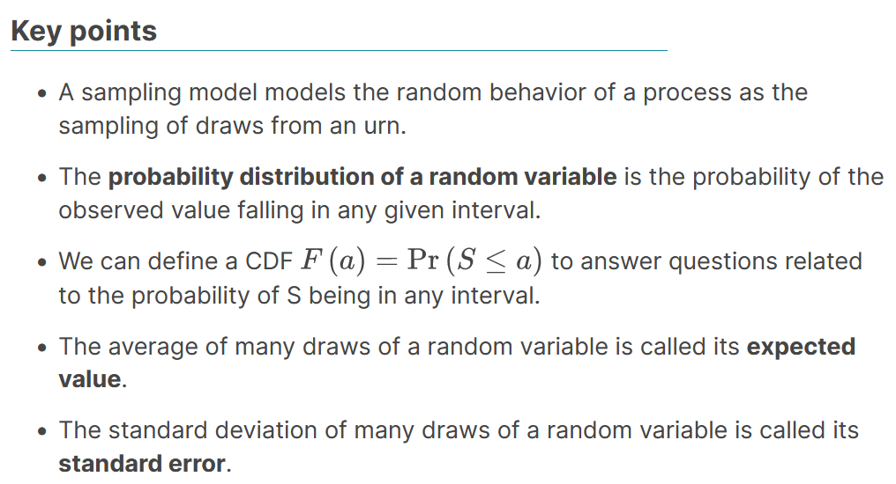

-   A sampling model models the random behavior of a process as the sampling of draws from an urn.
-   The **probability distribution of a random variable** is the probability of the observed value falling in any given interval.
-   We can define a CDF to answer questions related to the probability of S being in any interval.
-   The average of many draws of a random variable is called its **expected value**.
-   The standard deviation of many draws of a random variable is called its **standard error**.

### Monte Carlo simulation: Chance of casino losing money on roulette

We build a sampling model for the random variable S that represents the casino's total winnings. 

```{r}
# sampling model 1: define urn, then sample
color <- rep(c("Black", "Red", "Green"), c(18, 18, 2)) # define the urn for the sampling model
n <- 1000
X <- sample(ifelse(color == "Red", -1, 1), n, replace = TRUE)
X[1:10]

# sampling model 2: define urn inside sample function by noting probabilities
x <- sample(c(-1, 1), n, replace = TRUE, prob = c(9/19, 10/19))    # 1000 independent draws
S <- sum(x)    # total winnings = sum of draws
S #S is a random variable
```

We use the sampling model to run a Monte Carlo simulation and use the results to estimate the probability of the casino losing money.

```{r}
n <- 1000    # number of roulette players
B <- 10000    # number of Monte Carlo experiments
S <- replicate(B, {
    X <- sample(c(-1,1), n, replace = TRUE, prob = c(9/19, 10/19))    # simulate 1000 spins
    sum(X)    # determine total profit
})

mean(S < 0)    # probability of the casino losing money
```

We can plot a histogram of the observed values of S as well as the normal density curve based on the mean and standard deviation of S. Calculated simply with

```{r}
sd(S)
mean(S)
```

```{r}
library(tidyverse)
s <- seq(min(S), max(S), length = 100)    # sequence of 100 values across range of S
normal_density <- data.frame(s = s, f = dnorm(s, mean(S), sd(S))) # generate normal density for S
data.frame (S = S) %>%    # make data frame of S for histogram
    ggplot(aes(S, ..density..)) +
    geom_histogram(color = "black", binwidth = 10) +
    ylab("Probability") +
    geom_line(data = normal_density, mapping = aes(s, f), color = "blue")
```

Use QQ-plot to confirm that the normal approximation is close to perfect.

### Distributions versus Probability Distributions

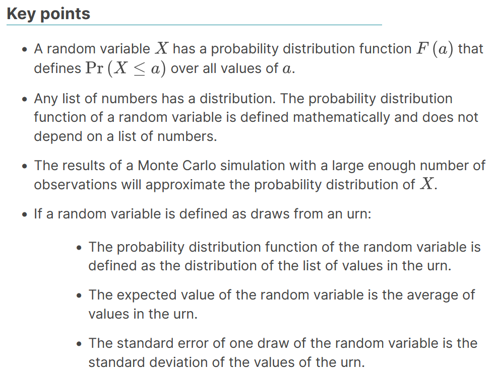

-   A random variable has a probability distribution function that defines over all values of .
-   Any list of numbers has a distribution. The probability distribution function of a random variable is defined mathematically and does not depend on a list of numbers.
-   The results of a Monte Carlo simulation with a large enough number of observations will approximate the probability distribution of .
-   If a random variable is defined as draws from an urn:
    -   The probability distribution function of the random variable is defined as the distribution of the list of values in the urn.

    -   The expected value of the random variable is the average of values in the urn.

    -   The standard error of one draw of the random variable is the standard deviation of the values of the urn.

### Notation for Random Variables

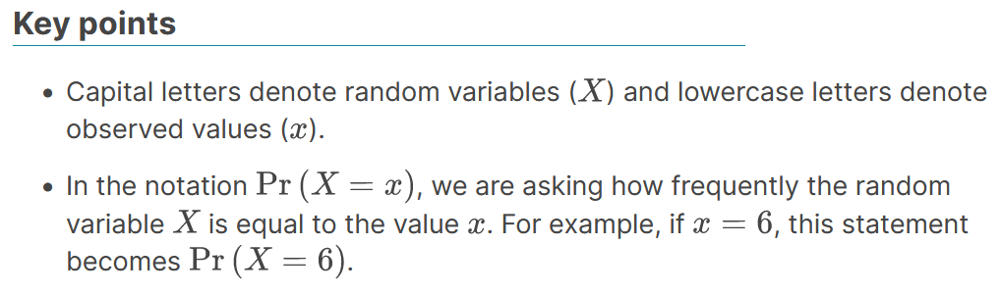

-   Capital letters denote random variables () and lowercase letters denote observed values ().
-   In the notation , we are asking how frequently the random variable is equal to the value . For example, if , this statement becomes .

### Central Limit Theorem

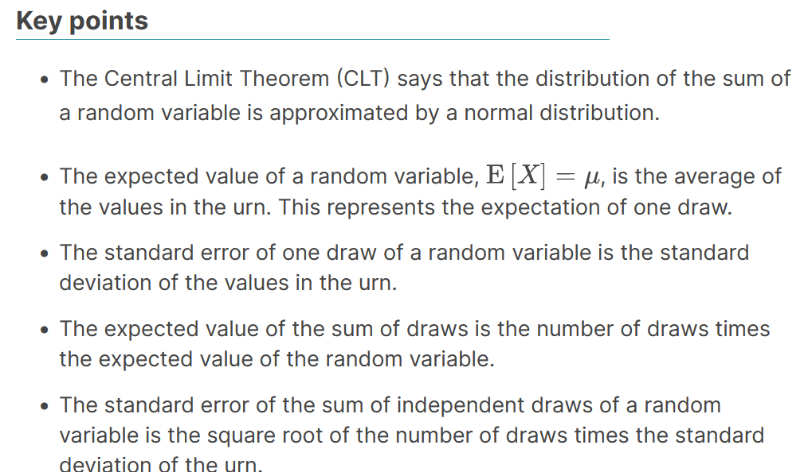

```{r}
B <- 10^6 #million games
X <- sample(c(-1,1), B, replace = TRUE, prob = c(9/19, 10/19))
mean(X)
```

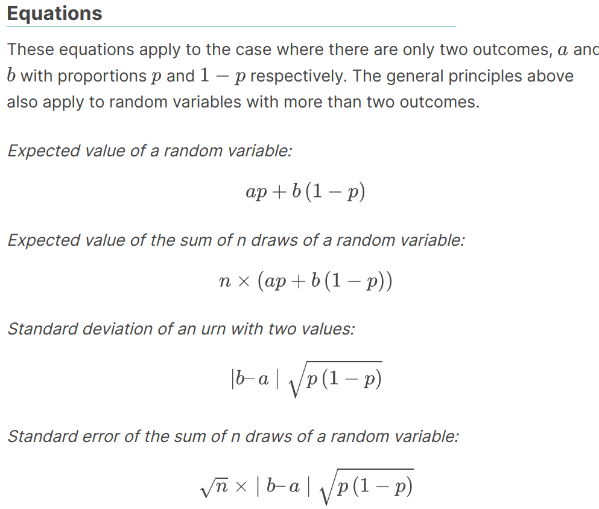

-   The Central Limit Theorem (CLT) says that the distribution of the sum of a random variable is approximated by a normal distribution.
-   The expected value of a random variable, , is the average of the values in the urn. This represents the expectation of one draw. 
-   The standard error of one draw of a random variable is the standard deviation of the values in the urn.
-   The expected value of the sum of draws is the number of draws times the expected value of the random variable. 
-   The standard error of the sum of independent draws of a random variable is the square root of the number of draws times the standard deviation of the urn. 

These equations apply to the case where there are only two outcomes, and with proportions and respectively. The general principles above also apply to random variables with more than two outcomes.

*Expected value of a random variable:* 

*Expected value of the sum of n draws of a random variable:* 

*Standard deviation of an urn with two values:* 

*Standard error of the sum of n draws of a random variable:*

```{r}
n <- 1000
sqrt(n) * 2 * sqrt(90/19)
#How likely is the casino to lose money?
mu <- n*(20-18)/38
se <- sqrt(n) * 2 * sqrt(90)/19
pnorm(0, mu, se)
```

# DataCamp Assessment: Random Variables and Sampling Models

# Exercise 1. American Roulette probabilities

An American roulette wheel has 18 red, 18 black, and 2 green pockets. Each red and black pocket is associated with a number from 1 to 36. The two remaining green slots feature "0" and "00". Players place bets on which pocket they think a ball will land in after the wheel is spun. Players can bet on a specific number (0, 00, 1-36) or color (red, black, or green).

What are the chances that the ball lands in a green pocket?

-   Define a variable `p_green` as the probability of the ball landing in a green pocket.

-   Print the value of `p_green`.

```{r}
# The variables `green`, `black`, and `red` contain the number of pockets for each color
green <- 2
black <- 18
red <- 18

# Assign a variable `p_green` as the probability of the ball landing in a green pocket
p_green <- (green)/(green + black + red)

# Print the variable `p_green` to the console
p_green
```

# Exercise 2. American Roulette payout

In American roulette, the payout for winning on green is \$17. This means that if you bet \$1 and it lands on green, you get \$17 as a prize.

Create a model to predict your winnings from betting on green one time.

-   Use the `sample` function return a random value from a specified range of values.

-   Use the `prob =` argument in the `sample` function to specify a vector of probabilities for returning each of the values contained in the vector of values being sampled.

-   Take a single sample (n = 1).

```{r}
# Use the `set.seed` function to make sure your answer matches the expected result after random sampling.
set.seed(1)

# The variables 'green', 'black', and 'red' contain the number of pockets for each color
green <- 2
black <- 18
red <- 18

# Assign a variable `p_green` as the probability of the ball landing in a green pocket
p_green <- green / (green+black+red)

# Assign a variable `p_not_green` as the probability of the ball not landing in a green pocket
p_not_green <- 1-p_green

# Create a model to predict the random variable `X`, your winnings from betting on green. Sample one time.
X <- sample(c(-1,17), 1, replace = TRUE, prob = c(1-p_green, p_green))

# Print the value of `X` to the console
X

```

# Exercise 3. American Roulette expected value

In American roulette, the payout for winning on green is \$17. This means that if you bet \$1 and it lands on green, you get \$17 as a prize.In the previous exercise, you created a model to predict your winnings from betting on green.

Now, compute the expected value of X, the random variable you generated previously.

-   Using the chances of winning \$17 (`p_green`) and the chances of losing \$1 (`p_not_green`), calculate the expected outcome of a bet that the ball will land in a green pocket.

```{r}
# The variables 'green', 'black', and 'red' contain the number of pockets for each color
green <- 2
black <- 18
red <- 18

# Assign a variable `p_green` as the probability of the ball landing in a green pocket
p_green <- green / (green+black+red)

# Assign a variable `p_not_green` as the probability of the ball not landing in a green pocket
p_not_green <- 1-p_green

# Calculate the expected outcome if you win $17 if the ball lands on green and you lose $1 if the ball doesn't land on green
(17)*(p_green)+(-1)*(p_not_green)
```

# Exercise 4. American Roulette standard error

The standard error of a random variable X tells us the difference between a random variable and its expected value. You calculated a random variable X in exercise 2 and the expected value of that random variable in exercise 3.

Now, compute the standard error of that random variable, which represents a single outcome after one spin of the roulette wheel.

-   Compute the standard error of the random variable you generated in exercise 2, or the outcome of any one spin of the roulette wheel.

-   Recall that the payout for winning on green is \$17 for a \$1 bet.

```{r}
# The variables 'green', 'black', and 'red' contain the number of pockets for each color
green <- 2
black <- 18
red <- 18

# Assign a variable `p_green` as the probability of the ball landing in a green pocket
p_green <- green / (green+black+red)

# Assign a variable `p_not_green` as the probability of the ball not landing in a green pocket
p_not_green <- 1-p_green

# Compute the standard error of the random variable
abs((-1-17))*sqrt(p_green*(p_not_green))
```

# Exercise 5. American Roulette sum of winnings

You modeled the outcome of a single spin of the roulette wheel, X, in exercise 2.

Now create a random variable S that sums your winnings after betting on green 1,000 times.

-   Use `set.seed` to make sure the result of your random operation matches the expected answer for this problem.

-   Specify the number of times you want to sample from the possible outcomes.

-   Use the `sample` function to return a random value from a vector of possible values.

-   Be sure to assign a probability to each outcome and to indicate that you are sampling with replacement.

-   Do not use `replicate` as this changes the output of random sampling and your answer will not match the grader.

```{r}
# The variables 'green', 'black', and 'red' contain the number of pockets for each color
green <- 2
black <- 18
red <- 18

# Assign a variable `p_green` as the probability of the ball landing in a green pocket
p_green <- green / (green+black+red)

# Assign a variable `p_not_green` as the probability of the ball not landing in a green pocket
p_not_green <- 1-p_green

# Use the `set.seed` function to make sure your answer matches the expected result after random sampling
set.seed(1)

# Define the number of bets using the variable 'n'
n <- 1000

# Create a vector called 'X' that contains the outcomes of 1000 samples
X <- sample(c(-1,17), n, replace = TRUE, prob = c(1-p_green, p_green))

# Assign the sum of all 1000 outcomes to the variable 'S'
S <- sum(X)

# Print the value of 'S' to the console
S
```

# Exercise 6. American Roulette winnings expected value

In the previous exercise, you generated a vector of random outcomes, S, after betting on green 1,000 times.

What is the expected value of S?

-   Using the chances of winning \$17 (`p_green`) and the chances of losing \$1 (`p_not_green`), calculate the expected outcome of a bet that the ball will land in a green pocket over 1,000 bets.

```{r}
# The variables 'green', 'black', and 'red' contain the number of pockets for each color
green <- 2
black <- 18
red <- 18

# Assign a variable `p_green` as the probability of the ball landing in a green pocket
p_green <- green / (green+black+red)

# Assign a variable `p_not_green` as the probability of the ball not landing in a green pocket
p_not_green <- 1-p_green

# Define the number of bets using the variable 'n'
n <- 1000

# Calculate the expected outcome of 1,000 spins if you win $17 when the ball lands on green and you lose $1 when the ball doesn't land on green
n * ((17)*(p_green)+(-1)*(p_not_green))
```

# Exercise 7. American Roulette winnings expected value

You generated the expected value of S, the outcomes of 1,000 bets that the ball lands in the green pocket, in the previous exercise.

What is the standard error of S?

-   Compute the standard error of the random variable you generated in exercise 5, or the outcomes of 1,000 spins of the roulette wheel.

```{r}
# The variables 'green', 'black', and 'red' contain the number of pockets for each color
green <- 2
black <- 18
red <- 18

# Assign a variable `p_green` as the probability of the ball landing in a green pocket
p_green <- green / (green+black+red)

# Assign a variable `p_not_green` as the probability of the ball not landing in a green pocket
p_not_green <- 1-p_green

# Define the number of bets using the variable 'n'
n <- 1000

# Compute the standard error of the sum of 1,000 outcomes
sqrt(n) * (abs(-1-17)*sqrt(p_green*(p_not_green)))
```

# 3.2 Random Variables and Sampling Models

### Averages and Proportions

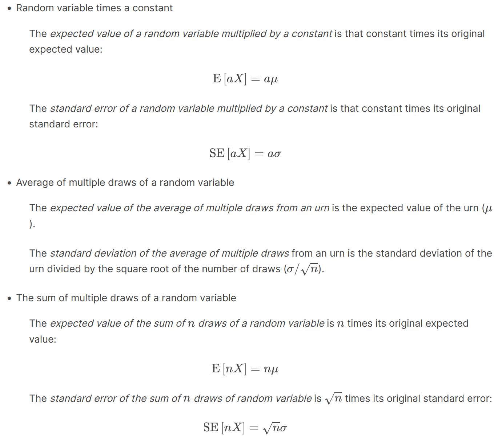

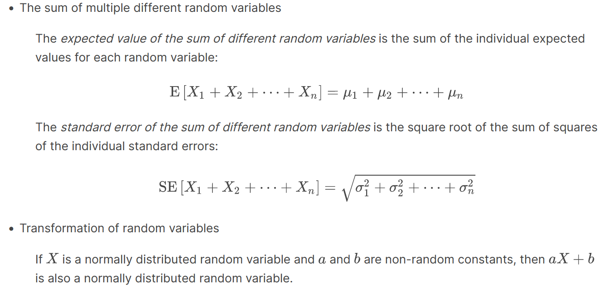

### Law of Large Numbers

-   The law of large numbers states that as increases, the standard error of the average of a random variable decreases. In other words, when is large, the average of the draws converges to the average of the urn.

-   The law of large numbers is also known as the law of averages.

-   The law of averages only applies when is very large and events are independent. It is often misused to make predictions about an event being "due" because it has happened less frequently than expected in a small sample size.

### How Large is Large in CLT?

-   The sample size required for the Central Limit Theorem and Law of Large Numbers to apply differs based on the probability of success.

    -   If the probability of success is high, then relatively few observations are needed.

    -   As the probability of success decreases, more observations are needed.

-   If the probability of success is extremely low, such as winning a lottery, then the Central Limit Theorem may not apply even with extremely large sample sizes. The normal distribution is not a good approximation in these cases, and other distributions such as the Poisson distribution (not discussed in these courses) may be more appropriate.

# DataCamp Assessment: The Central Limit Theorem

# Exercise 1. American Roulette probability of winning money

The exercises in the previous chapter explored winnings in American roulette. In this chapter of exercises, we will continue with the roulette example and add in the Central Limit Theorem.

In the previous chapter of exercises, you created a random variable S that is the sum of your winnings after betting on green a number of times in American Roulette.

What is the probability that you end up winning money if you bet on green 100 times?

-   Execute the sample code to determine the expected value `avg` and standard error `se` as you have done in previous exercises.

-   Use the `pnorm` function to determine the probability of winning money.

```{r}
# Assign a variable `p_green` as the probability of the ball landing in a green pocket
p_green <- 2 / 38

# Assign a variable `p_not_green` as the probability of the ball not landing in a green pocket
p_not_green <- 1-p_green

# Define the number of bets using the variable 'n'
n <- 100

# Calculate 'avg', the expected outcome of 100 spins if you win $17 when the ball lands on green and you lose $1 when the ball doesn't land on green
avg <- n * (17*p_green + -1*p_not_green)

# Compute 'se', the standard error of the sum of 100 outcomes
se <- sqrt(n) * (17 - -1)*sqrt(p_green*p_not_green)

# Using the expected value 'avg' and standard error 'se', compute the probability that you win money betting on green 100 times.
1-pnorm(0,avg,se)
```

# Exercise 2. American Roulette Monte Carlo simulation

Create a Monte Carlo simulation that generates 10,000 outcomes of S, the sum of 100 bets.

Compute the average and standard deviation of the resulting list and compare them to the expected value (-5.263158) and standard error (40.19344) for S that you calculated previously.

-   Use the `replicate` function to replicate the sample code for `B <- 10000` simulations.

-   Within `replicate`, use the `sample` function to simulate `n <- 100` outcomes of either a win (17) or a loss (-1) for the bet. Use the order `c(17, -1)` and corresponding probabilities. Then, use the `sum` function to add up the winnings over all iterations of the model. *Make sure to include `sum` or DataCamp may crash with a "Session Expired" error.*

-   Use the `mean` function to compute the average winnings.

-   Use the `sd` function to compute the standard deviation of the winnings.

```{r}
# Assign a variable `p_green` as the probability of the ball landing in a green pocket
p_green <- 2 / 38

# Assign a variable `p_not_green` as the probability of the ball not landing in a green pocket
p_not_green <- 1-p_green

# Define the number of bets using the variable 'n'
n <- 100

# The variable `B` specifies the number of times we want the simulation to run. Let's run the Monte Carlo simulation 10,000 times.
B <- 10000

# Use the `set.seed` function to make sure your answer matches the expected result after random sampling.
set.seed(1)

# Create an object called `S` that replicates the sample code for `B` iterations and sums the outcomes.
S <- replicate(B,{
  sim <- sample(c(17,-1), n, replace = TRUE, prob = c(p_green, p_not_green))
  sum(sim)
})
sum(S)

# Compute the average value for 'S'
mean(S)

# Calculate the standard deviation of 'S'
sd(S)

```

# Exercise 3. American Roulette Monte Carlo vs CLT

In this chapter, you calculated the probability of winning money in American roulette using the CLT.

Now, calculate the probability of winning money from the Monte Carlo simulation. The Monte Carlo simulation from the previous exercise has already been pre-run for you, resulting in the variable `S` that contains a list of 10,000 simulated outcomes.

-   Use the `mean` function to calculate the probability of winning money from the Monte Carlo simulation, `S`.

```{r}
# Calculate the proportion of outcomes in the vector `S` that exceed $0
mean(S>0)
```

# Exercise 4. American Roulette Monte Carlo vs CLT comparison

The Monte Carlo result and the CLT approximation for the probability of losing money after 100 bets are close, but not that close. What could account for this?

Ans. The CLT does not work as well when the probability of success is small. If we make the number of roulette plays bigger, the probabilities will match better.

# Exercise 5. American Roulette average winnings per bet

Now create a random variable Y that contains your average winnings per bet after betting on green 10,000 times.

-   Run a *single* Monte Carlo simulation of 10,000 bets using the following steps. (You do *not* need to `replicate` the `sample` code.)

-   Specify `n` as the number of times you want to sample from the possible outcomes.

-   Use the `sample` function to return `n` values from a vector of possible values: winning \$17 or losing \$1. Be sure to assign a probability to each outcome and indicate that you are sampling with replacement.

-   Calculate the average result per bet placed using the `mean` function.

```{r}
# Use the `set.seed` function to make sure your answer matches the expected result after random sampling.
set.seed(1)

# Define the number of bets using the variable 'n'
n <- 10000

# Assign a variable `p_green` as the probability of the ball landing in a green pocket
p_green <- 2 / 38

# Assign a variable `p_not_green` as the probability of the ball not landing in a green pocket
p_not_green <- 1 - p_green

# Create a vector called `X` that contains the outcomes of `n` bets
X <- sample(c(17,-1), n, replace = TRUE, prob = c(p_green, p_not_green))

# Define a variable `Y` that contains the mean outcome per bet. Print this mean to the console.
Y <- mean(X)
Y
```

The mean outcome per bet is a weighted average of these possible outcomes based on their probabilities. The printed result (`Y`) gives you an idea of the expected value or average outcome for each bet in this scenario.

# Exercise 6. American Roulette per bet expected value

What is the expected value of Y, the average outcome per bet after betting on green 10,000 times?

-   Using the chances of winning \$17 (`p_green`) and the chances of losing \$1 (`p_not_green`), calculate the expected outcome of a bet that the ball will land in a green pocket.

-   Use the expected value formula rather than a Monte Carlo simulation.

-   Print this value to the console (do not assign it to a variable).

```{r}
# Assign a variable `p_green` as the probability of the ball landing in a green pocket
p_green <- 2 / 38

# Assign a variable `p_not_green` as the probability of the ball not landing in a green pocket
p_not_green <- 1 - p_green

# Calculate the expected outcome of `Y`, the mean outcome per bet in 10,000 bets
(17)*(p_green) + (-1)*(p_not_green)
```

# Exercise 7. American Roulette per bet standard error

What is the standard error of Y, the average result of 10,000 spins?

Compute the standard error of Y, the average result of 10,000 independent spins.

```{r}
# Define the number of bets using the variable 'n'
n <- 10000

# Assign a variable `p_green` as the probability of the ball landing in a green pocket
p_green <- 2 / 38

# Assign a variable `p_not_green` as the probability of the ball not landing in a green pocket
p_not_green <- 1 - p_green

# Compute the standard error of 'Y', the mean outcome per bet from 10,000 bets.
abs(-1 - 17) * sqrt(p_green * p_not_green)/sqrt(n)
```

# Exercise 8. American Roulette winnings per game are positive

What is the probability that your winnings are positive after betting on green 10,000 times?

-   Execute the code that we wrote in previous exercises to determine the average and standard error.

-   Use the `pnorm` function to determine the probability of winning more than \$0.

```{r}
# We defined the average using the following code
avg <- 17*p_green + -1*p_not_green

# We defined standard error using this equation
se <- 1/sqrt(n) * (17 - -1)*sqrt(p_green*p_not_green)

# Given this average and standard error, determine the probability of winning more than $0. Print the result to the console.
1-pnorm(0,avg,se)
```

# Exercise 9. American Roulette Monte Carlo again

Create a Monte Carlo simulation that generates 10,000 outcomes of S, the average outcome from 10,000 bets on green.

Compute the average and standard deviation of the resulting list to confirm the results from previous exercises using the Central Limit Theorem.

-   Use the `replicate` function to model 10,000 iterations of a series of 10,000 bets.

-   Each iteration inside `replicate` should simulate 10,000 bets and determine the average outcome of those 10,000 bets. *If you forget to take the mean, DataCamp will crash with a "Session Expired" error.*

-   Find the average of the 10,000 average outcomes. Print this value to the console.

-   Compute the standard deviation of the 10,000 simulations. Print this value to the console.

```{r}
## Make sure you fully follow instructions, including printing values to the console and correctly running the `replicate` loop. If not, you may encounter "Session Expired" errors.

# The variable `n` specifies the number of independent bets on green
n <- 10000

# The variable `B` specifies the number of times we want the simulation to run
B <- 10000

# Use the `set.seed` function to make sure your answer matches the expected result after random number generation
set.seed(1)

# Generate a vector `S` that contains the the average outcomes of 10,000 bets modeled 10,000 times
S <- replicate(B, {
  sim <- sample(c(17,-1), n, replace = TRUE, prob = c(p_green, p_not_green))
  mean(sim)
})

# Compute the average of `S`
mean(S)

# Compute the standard deviation of `S`
sd(S)
```

# Exercise 10. American Roulette comparison

In a previous exercise, you found the probability of winning more than \$0 after betting on green 10,000 times using the Central Limit Theorem. Then, you used a Monte Carlo simulation to model the average result of betting on green 10,000 times over 10,000 simulated series of bets.

What is the probability of winning more than \$0 as estimated by your Monte Carlo simulation? The code to generate the vector `S` that contains the the average outcomes of 10,000 bets modeled 10,000 times has already been run for you.

-   Calculate the probability of winning more than \$0 in the Monte Carlo simulation from the previous exercise using the `mean` function.

-   You do *not* need to run another simulation: the results of the simulation are in your workspace as the vector `S`.

```{r}
# Compute the proportion of outcomes in the vector 'S' where you won more than $0
mean(S>0)
```

# Exercise 11. American Roulette comparison analysis

The Monte Carlo result and the CLT approximation are now much closer than when we calculated the probability of winning for 100 bets on green. What could account for this difference?

Ans. The CLT works better when the sample size is larger. We increased the sample size from 100 bets to 10,000 bets.

# 3.3 Assessment: Random Variables, Sampling Models, and the Central Limit Theorem (15 Questions)

# Questions 1 and 2: SAT testing

The SAT is a standardized college admissions test used in the United States. The following two multi-part questions will ask you some questions about SAT testing.

This is a 6-part question asking you to determine some probabilities of what happens when a student guessed for all of their answers on the SAT. Use the information below to inform your answers for the following questions.

An old version of the SAT college entrance exam had a -0.25 point penalty for every incorrect answer and awarded 1 point for a correct answer. The quantitative test consisted of 44 multiple-choice questions each with 5 answer choices. Suppose a student chooses answers by guessing for all questions on the test.

### Question 1a

What is the probability of guessing correctly for one question?

```{r}
p <- 1/5 # one correct choice of 5 options
p
```

### Question 1b

What is the expected value of points for guessing on one question?

```{r}
a <- 1
b <- -0.25
mu <- a*p + b*(1-p)
mu
```

### Question 1c

What is the expected score of guessing on all 44 questions?

```{r}
n <- 44
n*mu
```

### Question 1d

What is the standard error of guessing on all 44 questions?

```{r}
sigma <- sqrt(n) * abs(b-a) * sqrt(p*(1-p))
sigma
```

### Question 1e

Use the Central Limit Theorem to determine the probability that a guessing student scores 8 points or higher on the test.

```{r}
1-pnorm(8, mu, sigma)
```

### Question 1f

Set the seed to 21, then run a Monte Carlo simulation of 10,000 students guessing on the test.

(IMPORTANT! If you use R 3.6 or later, you will need to use the command `set.seed(x, sample.kind = "Rounding")` instead of `set.seed(x)`. Your R version will be printed at the top of the Console window when you start RStudio.)

What is the probability that a guessing student scores 8 points or higher?

```{r}
set.seed(21, sample.kind = "Rounding")
B <- 10000
S <- replicate(B, {
  simulation <- sample(c(1,-0.25), n, replace = TRUE, prob = c(p, 1-p))
  sum(simulation)
})

mean(S >= 8)
```

The SAT was recently changed to reduce the number of multiple choice options from 5 to 4 and also to eliminate the penalty for guessing.

In this two-part question, you'll explore how that affected the expected values for the test.

### Question 2a

Suppose that the number of multiple choice options is 4 and that there is no penalty for guessing - that is, an incorrect question gives a score of 0.

What is the expected value of the score when guessing on this new test?

```{r}
p <- 1/4
a <- 1
b <- 0
n <- 44
mu <- n * a*p + b*(1-p)
mu
```

### Question 2b

Consider a range of correct answer probabilities `p <- seq(0.25, 0.95, 0.05)` representing a range of student skills.

What is the lowest `p` such that the probability of scoring over 35 exceeds 80%?

```{r}
p <- seq(0.25, 0.95, 0.05)
exp_val <- sapply(p, function(x){
  mu <- n * a*x + b*(1-x)
  sigma <- sqrt(n) * abs(b-a) * sqrt(x*(1-x))
  1-pnorm(35, mu, sigma)
})

min(p[which(exp_val > 0.8)])
```

-   `exp_val`: Presumably, this is a vector of expected values or some calculated values.

-   `exp_val > 0.8`: This creates a logical vector of `TRUE` and `FALSE` values, where each element indicates whether the corresponding element in `exp_val` is greater than 0.8.

-   `which(exp_val > 0.8)`: This returns the indices of the `TRUE` values in the logical vector obtained in the previous step. In other words, it gives the positions where `exp_val` is greater than 0.8.

-   `p[which(exp_val > 0.8)]`: This extracts the elements from the vector `p` that correspond to the positions where `exp_val` is greater than 0.8.

# Question 3: Betting on Roulette

A casino offers a House Special bet on roulette, which is a bet on five pockets (00, 0, 1, 2, 3) out of 38 total pockets. The bet pays out 6 to 1. In other words, a losing bet yields -\$1 and a successful bet yields \$6. A gambler wants to know the chance of losing money if he places 500 bets on the roulette House Special.

The following 7-part question asks you to do some calculations related to this scenario.

```{r}
p <- 5/38
a <- 6
b <- -1
n <- 500
a
```

### Question 3a

What is the expected value of the payout for one bet?

```{r}
exp_val <- a*p + b*(1-p)
mu <- exp_val
```

### Question 3b

What is the standard error of the payout for one bet?

```{r}
sigma <- sqrt(1) * abs(b-a) * sqrt(p*(1-p))
sigma
```

### Question 3c

What is the expected value of the average payout over 500 bets?

Remember there is a difference between expected value of the average and expected value of the sum.

```{r}
mu
```

### Question 3d

What is the standard error of the average payout over 500 bets?

Remember there is a difference between the standard error of the average and standard error of the sum.

```{r}
sigma/sqrt(n)
```

### Question 3e

What is the expected value of the sum of 500 bets?

```{r}
n*mu
```

### Question 3f

What is the standard error of the sum of 500 bets?

```{r}
sqrt(n)*sigma
```

### Question 3g

Use `pnorm()` with the expected value of the sum and standard error of the sum to calculate the probability of losing money over 500 bets, 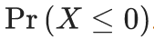{width="56" height="14"}.

```{r}
pnorm(0, n*mu, sqrt(n)*sigma)
```

# Section 4 Overview

Section 4 introduces you to the Big Short.

After completing Section 4, you will:

-   understand the relationship between sampling models and interest rates as determined by banks.

-   understand how interest rates can be set to minimize the chances of the bank losing money.

-   understand how inappropriate assumptions of independence contributed to the financial meltdown of 2007.

There is 1 assignment that uses the DataCamp platform for you to practice your coding skills. For IDV learners, there is an additional assignment with exercises on insurance that will comprehensively assess what you've learned throughout the course.

### The Big Short: Interest Rates Explained

-   Interest rates for loans are set using the probability of loan defaults to calculate a rate that minimizes the probability of losing money.

-   We can define the outcome of loans as a random variable. We can also define the sum of outcomes of many loans as a random variable.

-   The Central Limit Theorem can be applied to fit a normal distribution to the sum of profits over many loans. We can use properties of the normal distribution to calculate the interest rate needed to ensure a certain probability of losing money for a given probability of default.

### Code: Interest rate sampling model

This is the probability of defaulting; it's not going to happen for sure. That's why the values change.

```{r}
n <- 1000
loss_per_foreclosure <- -200000
p <- 0.02
defaults <- sample( c(0,1), n, prob=c(1-p, p), replace = TRUE)
sum(defaults * loss_per_foreclosure)
```

### Code: Interest rate Monte Carlo simulation

Use a Monte Carlo simulation to plot the distribution of losses.

```{r}
B <- 10000
losses <- replicate(B, {
    defaults <- sample( c(0,1), n, prob=c(1-p, p), replace = TRUE) 
  sum(defaults * loss_per_foreclosure)
})
```

### Code: Plotting expected losses

```{r}
library(tidyverse)
data.frame(losses_in_millions = losses/10^6) %>%
    ggplot(aes(losses_in_millions)) +
    geom_histogram(binwidth = 0.6, col = "black")
```

We do not need to use a Monte Carlo simulation: the CLT tells us that because our losses are a sum of independent draws, its distribution is approximately normal with expected value and standard deviation given by the formulas.

### Code: Expected value and standard error of the sum of 1,000 loans

```{r}
n*(p*loss_per_foreclosure + (1-p)*0)    # expected value 
sqrt(n)*abs(loss_per_foreclosure)*sqrt(p*(1-p))    # standard error
```

We now want to set an interest rate to guarantee that on average, we break even. We need to add a quantity x to each loan, which in this case are represented by draws, so that the expected value is zero (breaking even).

### Code: Calculating interest rates for expected value of 0

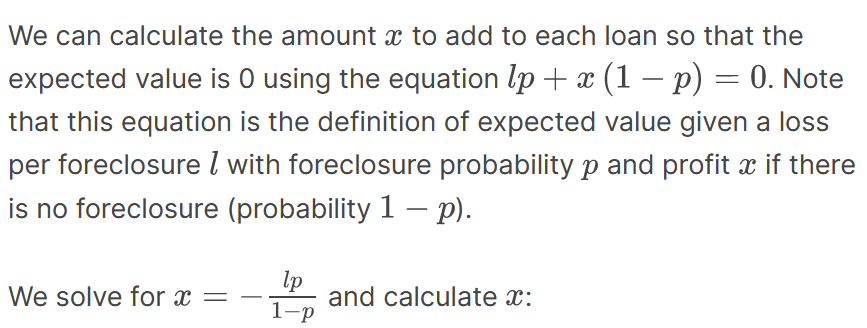

```{r}
x = - loss_per_foreclosure*p/(1-p)
x
```

On a \$180,000 loan, this equals an interest rate of:

```{r}
x/180000
```

Although this interest rate guarantees on average that we break even, there's a 50% chance that we will lose money. If our bank loses money, we have to close it down. So we need to pick an interest rate that makes it unlikely for this to happen. At the same time, if the interest rate is too high, our clients will go to another bank.

### Equations: Calculating interest rate for 1% probability of losing money

What does x have to be if we want our chances of losing money to be one in 100.

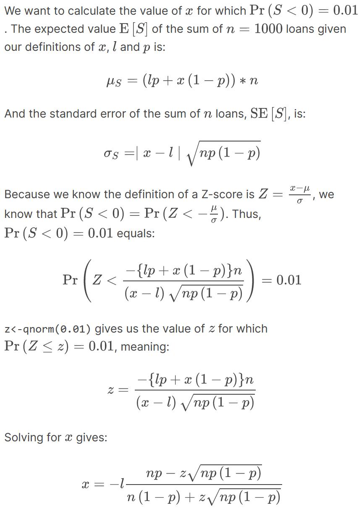

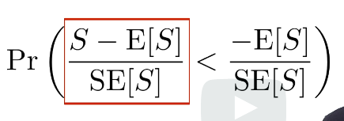

Red box is a standard normal random variable.

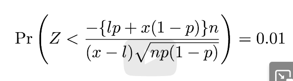

Note that since the term on the left is a normal random variable with expected value of zero and standard error one, it means that the quantity on the right must be equal to qnorm(0.01) = -2.32. Then the equation above will hold true. If we set little z to be qnorm of 0.01, this will give you a value for little z for which the following formula is true. 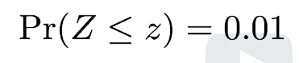

The probability of big Z less than or equal to little z is equal to 0.01. If we set little z to be qnorm of 0.01, this will give you a value of little z for which the following formula is true.

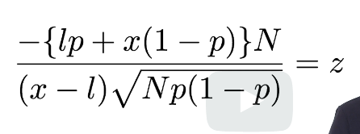

### Code: Calculating interest rate for 1% probability of losing money

```{r}
l <- loss_per_foreclosure
z <- qnorm(0.01)
x <- -l*( n*p - z*sqrt(n*p*(1-p)))/ ( n*(1-p) + z*sqrt(n*p*(1-p)))
x
x/180000    # interest rate
loss_per_foreclosure*p + x*(1-p)    # expected value of the profit per loan
n*(loss_per_foreclosure*p + x*(1-p)) # expected value of the profit over n loans
```

### Code: Monte Carlo simulation for 1% probability of losing money

Note that your results will vary from the video because the seed is not set.

```{r}
B <- 100000
profit <- replicate(B, {
    draws <- sample( c(x, loss_per_foreclosure), n, 
                        prob=c(1-p, p), replace = TRUE) 
    sum(draws)
})
mean(profit)    # expected value of the profit over n loans
mean(profit<0)    # probability of losing money
```

### The Big Short

-   The Central Limit Theorem states that the sum of independent draws of a random variable follows a normal distribution. However, when the draws are not independent, this assumption does not hold.

-   If an event changes the probability of default for all borrowers, then the probability of the bank losing money changes.

-   Monte Carlo simulations can be used to model the effects of unknown changes in the probability of default.

### Code: Expected value with higher default rate and interest rate

```{r}
p <- .04
loss_per_foreclosure <- -200000
r <- 0.05
x <- r*180000
loss_per_foreclosure*p + x*(1-p)
```

### Equations: Probability of losing money

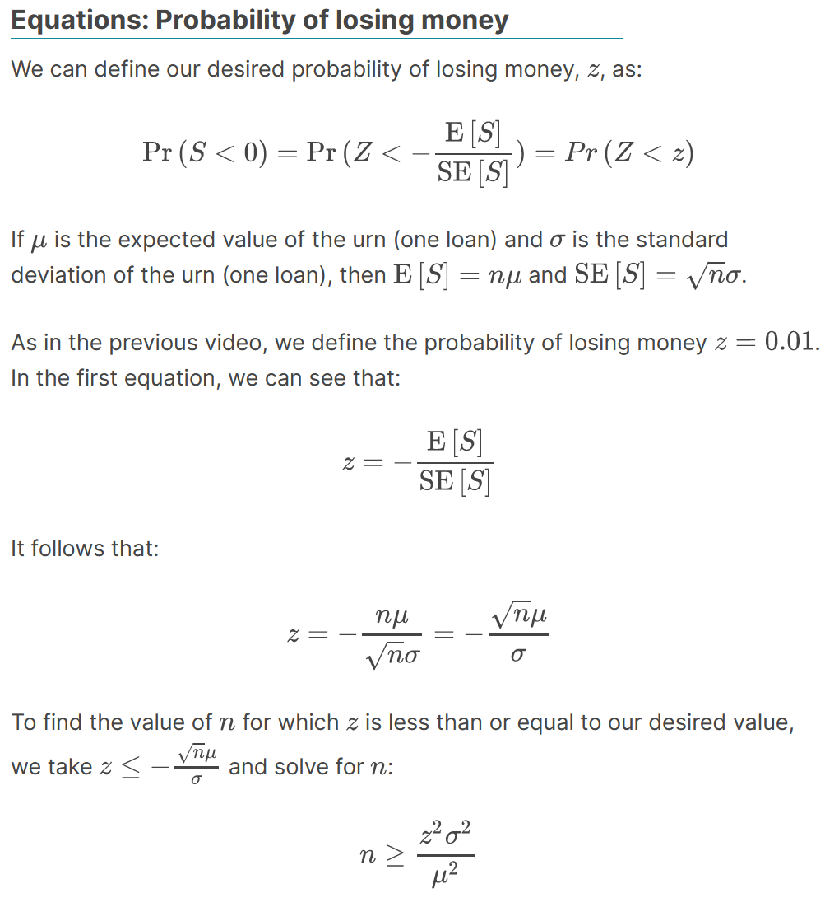

Form of the Law of Large Numbers: when n is large our average earning per loan converges to the expected earning mu.

### Code: Calculating number of loans for desired probability of losing money

The number of loans required is:

```{r}
z <- qnorm(0.01)
l <- loss_per_foreclosure
n <- ceiling((z^2*(x-l)^2*p*(1-p))/(l*p + x*(1-p))^2)
n    # number of loans required
n*(loss_per_foreclosure*p + x * (1-p))    # expected profit over n loans
```

### Code: Monte Carlo simulation with known default probability

This Monte Carlo simulation estimates the expected profit given a known probability of default p = 0.04. Note that your results will differ from the video because the seed is not set.

```{r}
B <- 10000
p <- 0.04
x <- 0.05 * 180000
profit <- replicate(B, {
    draws <- sample( c(x, loss_per_foreclosure), n, 
                        prob=c(1-p, p), replace = TRUE) 
    sum(draws)
})
mean(profit)
```

### Code: Monte Carlo simulation with unknown default probability

This Monte Carlo simulation estimates the expected profit given an unknown probability of default 0.03 \<= p \<= 0.05, modeling the situation where an event changes the probability of default for all borrowers simultaneously. Note that your results will differ from the video because the seed is not set.

```{r}
p <- 0.04
x <- 0.05*180000
profit <- replicate(B, {
    new_p <- 0.04 + sample(seq(-0.01, 0.01, length = 100), 1)
    draws <- sample( c(x, loss_per_foreclosure), n, 
                        prob=c(1-new_p, new_p), replace = TRUE)
    sum(draws)
})
mean(profit)    # expected profit
mean(profit < 0)    # probability of losing money
mean(profit < -10000000)    # probability of losing over $10 million
```

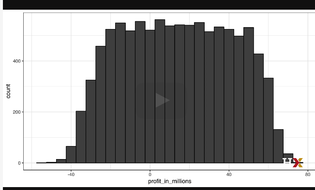

The theory completely breaks down, and our random variable has much more variability than expected. The financial meltdown of 2007 was due, among other things, to financial experts assuming independence when there was none.

# DataCamp Assessment: The Big Short

# Exercise 1. Bank earnings

Say you manage a bank that gives out 10,000 loans. The default rate is 0.03 and you lose \$200,000 in each foreclosure.

Create a random variable S that contains the earnings of your bank. Calculate the total amount of money lost in this scenario.

-   Using the `sample` function, generate a vector called `defaults` that contains `n` samples from a vector of `c(0,1)`, where `0` indicates a payment and `1` indicates a default

-   Multiply the total number of defaults by the loss per foreclosure.

```{r}
# Assign the number of loans to the variable `n`
n <- 10000

# Assign the loss per foreclosure to the variable `loss_per_foreclosure`
loss_per_foreclosure <- -200000

# Assign the probability of default to the variable `p_default`
p_default <- 0.03

# Use the `set.seed` function to make sure your answer matches the expected result after random sampling
set.seed(1)

# Generate a vector called `defaults` that contains the default outcomes of `n` loans
defaults <- sample(c(0,1), n, replace = TRUE, prob = c(1-0.03, 0.03))


# Generate `S`, the total amount of money lost across all foreclosures. Print the value to the console.
S <- sum(defaults) * loss_per_foreclosure

S
```

# Exercise 2. Bank earnings Monte Carlo

Run a Monte Carlo simulation with 10,000 outcomes for , the sum of losses over 10,000 loans. Make a histogram of the results.

-   Within a `replicate` loop with 10,000 iterations, use `sample` to generate a list of 10,000 loan outcomes: payment (0) or default (1). Use the outcome order `c(0,1)` and probability of default `p_default`.

-   Still within the loop, use the function `sum` to count the number of foreclosures multiplied by `loss_per_foreclosure` to return the sum of all losses across the 10,000 loans. *If you do not take the `sum` inside the `replicate` loop, DataCamp may crash with a "Session Expired" error.*

-   Plot the histogram of values using the function `hist`.

```{r}
# Assign the number of loans to the variable `n`
n <- 10000

# Assign the loss per foreclosure to the variable `loss_per_foreclosure`
loss_per_foreclosure <- -200000

# Assign the probability of default to the variable `p_default`
p_default <- 0.03

# Use the `set.seed` function to make sure your answer matches the expected result after random sampling
set.seed(1)

# The variable `B` specifies the number of times we want the simulation to run
B <- 10000

# Generate a list of summed losses 'S'. Replicate the code from the previous exercise over 'B' iterations to generate a list of summed losses for 'n' loans.  Ignore any warnings for now.
S <- replicate(B, {
    foreclosure_sim <- sample(c(0,1), n, replace = TRUE, prob = c(1-p_default, p_default))
    sum(foreclosure_sim) * loss_per_foreclosure
})


# Plot a histogram of 'S'.  Ignore any warnings for now.
hist(S)

```

# Exercise 3. Bank earnings expected value

What is the expected value of S, the sum of losses over 10,000 loans? For now, assume a bank makes no money if the loan is paid.

-   Using the chances of default (`p_default`), calculate the expected losses over 10,000 loans.

```{r}
# Assign the number of loans to the variable `n`
n <- 10000

# Assign the loss per foreclosure to the variable `loss_per_foreclosure`
loss_per_foreclosure <- -200000

# Assign the probability of default to the variable `p_default`
p_default <- 0.03

# Calculate the expected loss due to default out of 10,000 loans
n * loss_per_foreclosure * p_default


```

# Exercise 4. Bank earnings standard error

What is the standard error of S?

-   Compute the standard error of the random variable `S` you generated in the previous exercise, the summed outcomes of 10,000 loans.

```{r}
# Assign the number of loans to the variable `n`
n <- 10000

# Assign the loss per foreclosure to the variable `loss_per_foreclosure`
loss_per_foreclosure <- -200000

# Assign the probability of default to the variable `p_default`
p_default <- 0.03

# Compute the standard error of the sum of 10,000 loans
sqrt(n) * abs(loss_per_foreclosure) * sqrt(p_default * (1-p_default))
```

# Exercise 5. Bank earnings interest rate - 1

So far, we've been assuming that we make no money when people pay their loans and we lose a lot of money when people default on their loans. Assume we give out loans for \$180,000. How much money do we need to make when people pay their loans so that our net loss is \$0?

In other words, what interest rate do we need to charge in order to not lose money?

-   If the amount of money lost or gained equals 0, the probability of default times the total loss per default equals the amount earned per probability of the loan being paid.

-   Divide the total amount needed per loan by the loan amount to determine the interest rate.

```{r}
# Assign the loss per foreclosure to the variable `loss_per_foreclosure`
loss_per_foreclosure <- -200000

# Assign the probability of default to the variable `p_default`
p_default <- 0.03

# Assign a variable `x` as the total amount necessary to have an expected outcome of $0
x <- -loss_per_foreclosure*p_default/(1-p_default)

# Convert `x` to a rate, given that the loan amount is $180,000. Print this value to the console.
x/180000
```

# Exercise 6. Bank earnings interest rate - 2

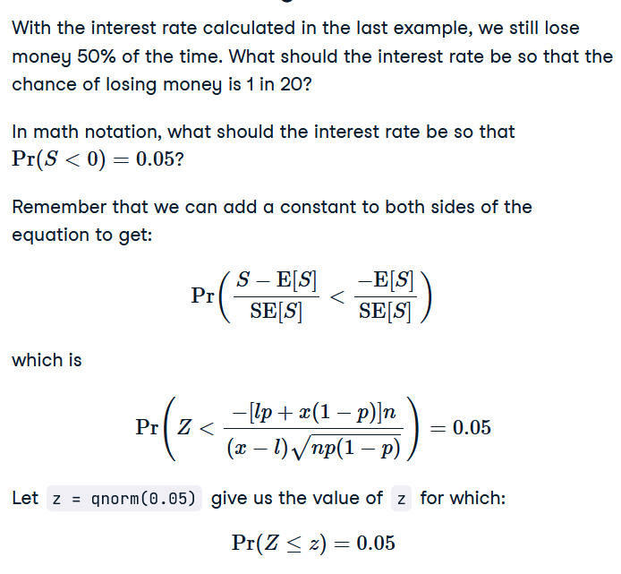

-   Use the `qnorm` function to compute a continuous variable at given quantile of the distribution to solve for `z`.


-   Divide `x` by the loan amount to calculate the rate.

```{r}
# Assign the number of loans to the variable `n`
n <- 10000

# Assign the loss per foreclosure to the variable `loss_per_foreclosure`
loss_per_foreclosure <- -200000

# Assign the probability of default to the variable `p_default`
p_default <- 0.03

# Generate a variable `z` using the `qnorm` function
z = qnorm(0.05)

# Generate a variable `x` using `z`, `p_default`, `loss_per_foreclosure`, and `n`
x <- -loss_per_foreclosure*( n*p_default - z*sqrt(n*p_default*(1-p_default)))/ ( n*(1-p_default) + z*sqrt(n*p_default*(1-p_default)))

# Convert `x` to an interest rate, given that the loan amount is $180,000. Print this value to the console.
x/180000
```

# Exercise 7. Bank earnings - minimize money loss

The bank wants to minimize the probability of losing money. Which of the following achieves their goal without making interest rates go up?

Ans. A reduced default rate.
