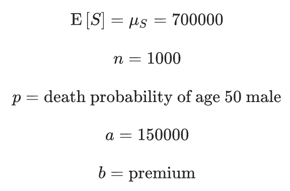

## Introduction to Assessment: The Big Short

### Introduction

These exercises, available to verified learners only, review and assess the following concepts:

-   Expected value and standard error of a single draw of a random variable

-   Expected value and standard error of the sum of draws of a random variable

-   Monte Carlo simulation of the sum of draws of a random variable

-   The Central Limit Theorem approximation of the sum of draws of a random variable

-   Using z-scores to calculate values related to the normal distribution and normal random variables

-   Calculating interest/premium rates to minimize chance of losing money

-   Determining a number of loans/policies required to profit

-   Simulating the effects of a change in event probability

### Setup and libraries

Run the code below to set up your environment and load the libraries you will need for the following exercises:

```{r}
library(tidyverse)
library(dslabs)
```

*IMPORTANT*: Some of these exercises use **dslabs** datasets that were added in a July 2019 update. Make sure your package is up to date with the command `install.packages("dslabs")`.

### Background

In the motivating example **The Big Short**, we discussed how discrete and continuous probability concepts relate to bank loans and interest rates. Similar business problems are faced by the insurance industry. 

Just as banks must decide how much to charge as interest on loans based on estimates of loan defaults, insurance companies must decide how much to charge as premiums for policies given estimates of the probability that an individual will collect on that policy. 

We will use data from [2015 US Period Life Tables External link](https://www.ssa.gov/oact/STATS/table4c6.html). Here is the code you will need to load and examine the data from **`dslabs`**:

```{r}
data(death_prob)
head(death_prob)
```

There are six multi-part questions for you to answer that follow.

Use the information below as you answer this 6-part question.

An insurance company offers a one-year term life insurance policy that pays \$150,000 in the event of death within one year. The premium (annual cost) for this policy for a 50 year old female is \$1,150. Suppose that in the event of a claim, the company forfeits the premium and loses a total of \$150,000, and if there is no claim the company gains the premium amount of \$1,150. The company plans to sell 1,000 policies to this demographic.

###    Question 1a 

The `death_prob` data frame from the **dslabs** package contains information about the estimated probability of death within 1 year (`prob`) for different ages and sexes.

Use `death_prob` to determine the death probability of a 50 year old female, `p`.

```{r}
library(dplyr)
head(death_prob)
death_prob %>% 
  filter(sex == "Female" & age == 50) %>%
  .$prob
```

###    Question 1b 

The loss in the event of the policy holder's death is -\$150,000 and the gain if the policy holder remains alive is the premium \$1,150.

What is the expected value of the company's net profit on one policy for a 50 year old female?

```{r}
p <- death_prob %>% 
  filter(sex == "Female" & age == 50) %>%
  .$prob
a <- -150000
b <- 1150
exp_val <- a*p+b*(1-p)
exp_val
mu <- exp_val
```

###    Question 1c 

Calculate the standard error of the profit on one policy for a 50 year old female.

```{r}
sigma <- sqrt(1) * abs(b-a) * sqrt(p*(1-p))
sigma
```

###    Question 1d 

What is the expected value of the company's profit over all 1,000 policies for 50 year old females?

```{r}
n <- 1000
mu*n
```

###    Question 1e 

What is the standard error of the sum of the expected value over all 1,000 policies for 50 year old females?

```{r}
sqrt(n)*sigma
```

###    Question 1f 

Use the Central Limit Theorem to calculate the probability that the insurance company loses money on this set of 1,000 policies.

```{r}
pnorm(0, mu*n, sqrt(n)*sigma)
```

50 year old males have a different probability of death than 50 year old females. We will calculate a profitable premium for 50 year old males in the following four-part question.

###    Question 2a 

Use `death_prob` to determine the probability of death within one year for a 50 year old male.

```{r}
pmale <- death_prob %>% 
  filter(sex == "Male" & age == 50) %>%
  .$prob
pmale
```

###    Question 2b 

Suppose the company wants its expected profits from 1,000 50 year old males with \$150,000 life insurance policies to be \$700,000. Use the formula for expected value of the sum of draws with the following values and solve for the premium :



What premium should be charged?

```{r}
b <- (700000 - n * a * pmale)/(n*(1-pmale))
b

#or
p <- p_male
mu_sum <- 700000
n <- 1000
a <- -150000

b <- (mu_sum/n-a*p)/(1-p)
b
```

###    Question 2c 

Using the new 50 year old male premium rate, calculate the standard error of the sum of 1,000 premiums.

```{r}
sigma_sum <- sqrt(n) * abs(b-a) * sqrt(pmale * (1 - pmale)) 
sigma_sum
```

###    Question 2d 

What is the probability of losing money on a series of 1,000 policies to 50 year old males?

```{r}
pnorm(0, 700000, sigma_sum)
```

# Questions 3 and 4: insurance rates, part 2

Life insurance rates are calculated using mortality statistics from the recent past. They are priced such that companies are almost assured to profit as long as the probability of death remains similar. If an event occurs that changes the probability of death in a given age group, the company risks significant losses.

In this 6-part question, we'll look at a scenario in which a lethal pandemic disease increases the probability of death within 1 year for a 50 year old to .015. Unable to predict the outbreak, the company has sold 1,000 \$150,000 life insurance policies for \$1,150.

###    Question 3a 

What is the expected value of the company's profits over 1,000 policies?

```{r}

```

###    Question 3b 

What is the standard error of the expected value of the company's profits over 1,000 policies?

```{r}

```

###    Question 3c 

What is the probability of the company losing money?

```{r}

```

###    Question 3d 

Suppose the company can afford to sustain one-time losses of \$1 million, but larger losses will force it to go out of business.

What is the probability of losing more than \$1 million?

```{r}

```

###    Question 3e 

Investigate death probabilities `p <- seq(.01, .03, .001)`.

What is the lowest death probability for which the chance of losing money exceeds 90%?

```{r}

```

###    Question 3f 

Investigate death probabilities `p <- seq(.01, .03, .0025)`.

What is the lowest death probability for which the chance of losing over \$1 million exceeds 90%?

```{r}

```

Question 4, which has two parts, continues the scenario from Question 3.

###    Question 4a 

Define a sampling model for simulating the total profit over 1,000 loans with probability of claim `p_loss = .015`, loss of -\$150,000 on a claim, and profit of \$1,150 when there is no claim. Set the seed to 25, then run the model once.

(IMPORTANT! If you use R 3.6 or later, you will need to use the command `set.seed(x, sample.kind = "Rounding")` instead of `set.seed(x)`. Your R version will be printed at the top of the Console window when you start RStudio.)

What is the reported profit (or loss) in millions (that is, divided by 10\^6)?

```{r}

```

###    Question 4b 

Set the seed to 27, then run a Monte Carlo simulation of your sampling model with 10,000 replicates to simulate the range of profits/losses over 1,000 loans.

(IMPORTANT! If you use R 3.6 or later, you will need to use the command `set.seed(x, sample.kind = "Rounding")` instead of `set.seed(x)`. Your R version will be printed at the top of the Console window when you start RStudio.)

What is the observed probability of losing \$1 million or more?

```{r}

```
