# Section 1: Parameters and Estimates

# Section 1 Overview

Section 1 introduces you to parameters and estimates.

After completing Section 1, you will be able to:

-   Understand how to use a sampling model to perform a poll.

-   Explain the terms **population**, **parameter**, and **sample** as they relate to statistical inference.

-   Use a sample to estimate the population proportion from the sample average.

-   Calculate the expected value and standard error of the sample average.

# Sampling Model Parameters and Estimates

-   The task of statistical inference is to estimate an unknown population parameter using observed data from a sample.

<!-- -->

-   In a sampling model, the collection of elements in the urn is called the *population.*

<!-- -->

-   A *parameter* is a number that summarizes data for an entire population.

<!-- -->

-   A *sample* is observed data from a subset of the population.

<!-- -->

-   An *estimate* is a summary of the observed data about a parameter that we believe is informative. It is a data-driven guess of the population parameter.


-   The sample proportion is a random variable. Sampling gives random results drawn from the population distribution.

### Code: Function for taking a random draw from a specific urn

The **dslabs** package includes a function for taking a random draw of size n from the urn described in the video:

```{r}
library(tidyverse)
library(dslabs)
ds_theme_set()
take_poll(25)    # draw 25 beads
```

### The Sample Average

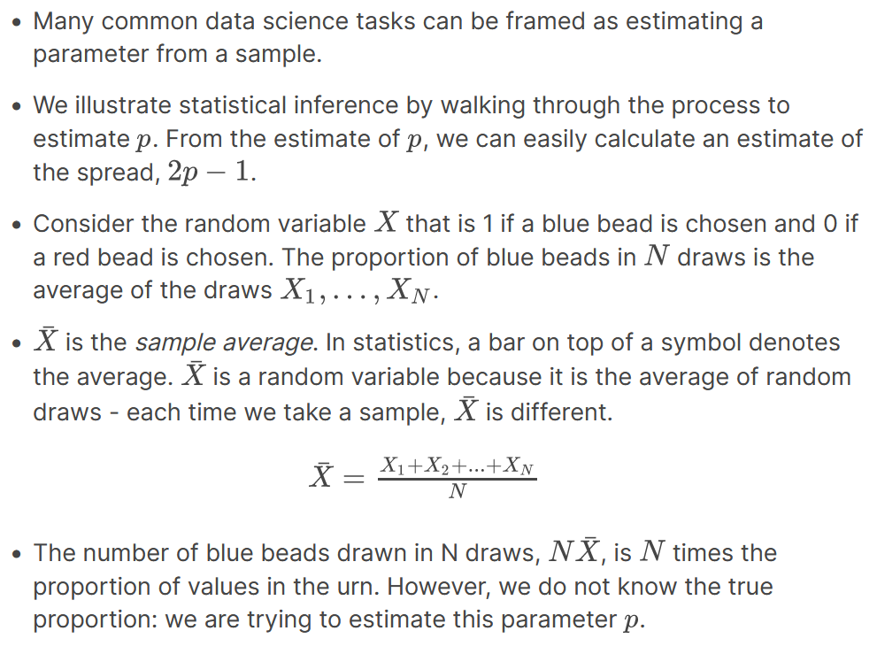

### Polling versus Forecasting

-   A poll taken in advance of an election estimates p for that moment, not for election day.

-   In order to predict election results, forecasters try to use early estimates of p to predict p on election day. We discuss some approaches in later sections.

### Properties of Our Estimate

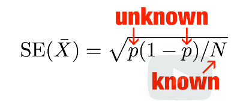{width="237"}](images/clipboard-1317090737.png)

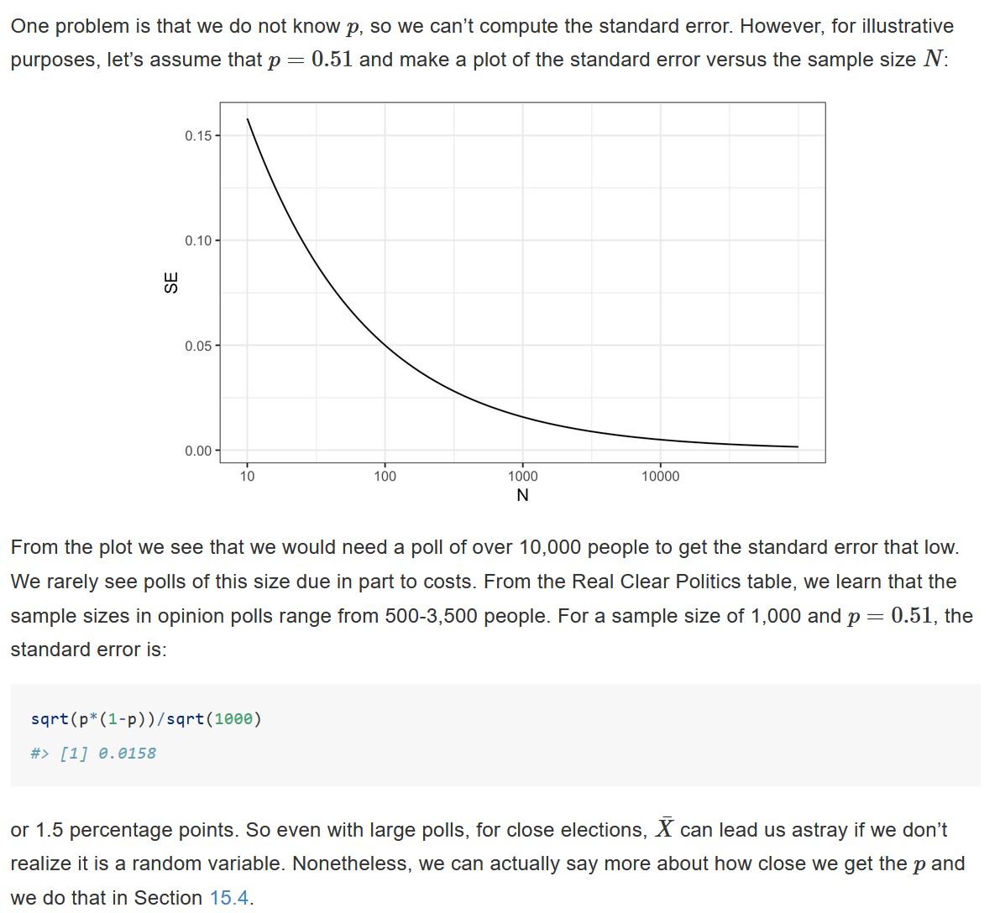

# Assessment 1.1: Parameters and Estimates

## Exercise 1. Polling - expected value of S

1\. Suppose you poll a population in which a proportion p of voters are Democrats and 1−p are Republicans. Your sample size is N=25. Consider the random variable S which is the **total** number of Democrats in your sample. What is the expected value of this random variable? Hint: it’s a function of p.

Ans. E(S) = 25 \* p

## Exercise 2. Polling - standard error of S

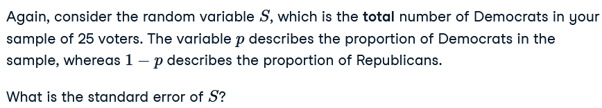

2\. What is the standard error of S ? Hint: it’s a function of p.

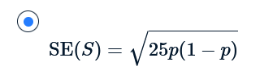{width="181"}

## Exercise 3. Polling - expected value of X-bar

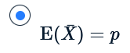{width="122"}](images/clipboard-2815746691.png)

3\. Consider the random variable S/N. This is equivalent to the sample average, which we have been denoting as ¯X. What is the expected value of the ¯X? Hint: it’s a function of p.

## Exercise 4. Polling - standard error of X-bar


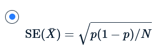{width="126"}

4\. What is the standard error of ¯X? Hint: it’s a function of p.

## Exercise 5. se versus p

Write a line of code that calculates the standard error `se` of a sample average when you poll 25 people in the population. Generate a sequence of 100 proportions of Democrats `p` that vary from 0 (no Democrats) to 1 (all Democrats).

Plot `se` versus `p` for the 100 different proportions.

-   Use the `seq` function to generate a vector of 100 values of `p` that range from 0 to 1.

-   Use the `sqrt` function to generate a vector of standard errors for all values of `p`.

-   Use the `plot` function to generate a plot with `p` on the x-axis and `se` on the y-axis.

```{r}
# `N` represents the number of people polled
N <- 25

# Create a variable `p` that contains 100 proportions ranging from 0 to 1 using the `seq` function
p <- seq(0,1, length.out = 100)
p

# Create a variable `se` that contains the standard error of each sample average
se <- sqrt(p*(1-p)/N)
se
# Plot `p` on the x-axis and `se` on the y-axis
plot(p, se)
```

## Exercise 6. Multiple plots of se versus p

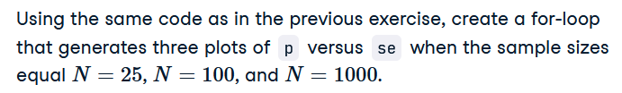

-   Your for-loop should contain two lines of code to be repeated for three different values of N.

-   The first line within the for-loop should use the `sqrt` function to generate a vector of standard errors `se` for all values of `p`.

-   The second line within the for-loop should use the `plot` function to generate a plot with `p` on the x-axis and `se` on the y-axis.

-   Use the `ylim` argument to keep the y-axis limits constant across all three plots. The lower limit should be equal to 0 and the upper limit should equal 0.1 (it can be shown that this value is the highest calculated standard error across all values of `p` and `N`).

```{r}
# The vector `p` contains 100 proportions of Democrats ranging from 0 to 1 using the `seq` function
p <- seq(0, 1, length = 100)

# The vector `sample_sizes` contains the three sample sizes
sample_sizes <- c(25, 100, 1000)

# Write a for-loop that calculates the standard error `se` for every value of `p` for each of the three samples sizes `N` in the vector `sample_sizes`. Plot the three graphs, using the `ylim` argument to standardize the y-axis across all three plots.
for(n in sample_sizes){
    se <- sqrt(p*(1-p)/sample_sizes)
    plot(p, se, ylim = c(0, 0.1))
}
```

## Exercise 7. Expected value of d

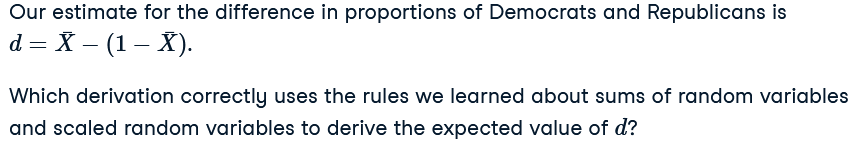

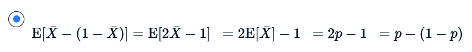

## Exercise 8. Standard error of d

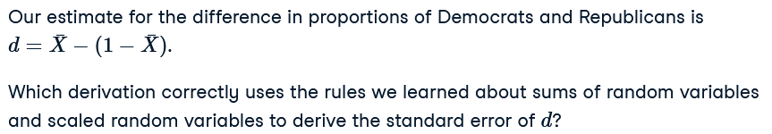

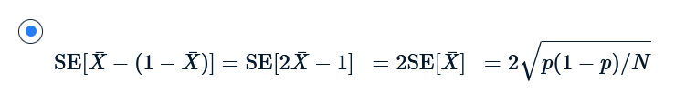

## Exercise 9. Standard error of the spread

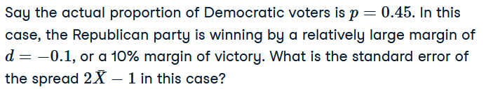

```{r}
# `N` represents the number of people polled
N <- 25

# `p` represents the proportion of Democratic voters
p <- 0.45

# Calculate the standard error of the spread. Print this value to the console.
2*sqrt(p*(1-p)/N)
```

## Exercise 10. Sample size

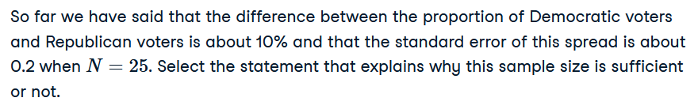


# Section 2 Overview

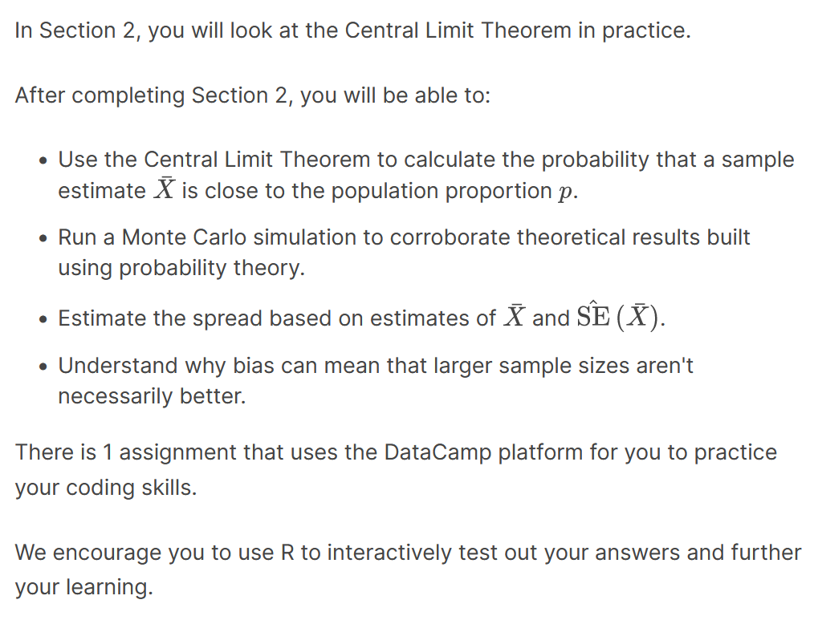

### The Central Limit Theorem in Practice

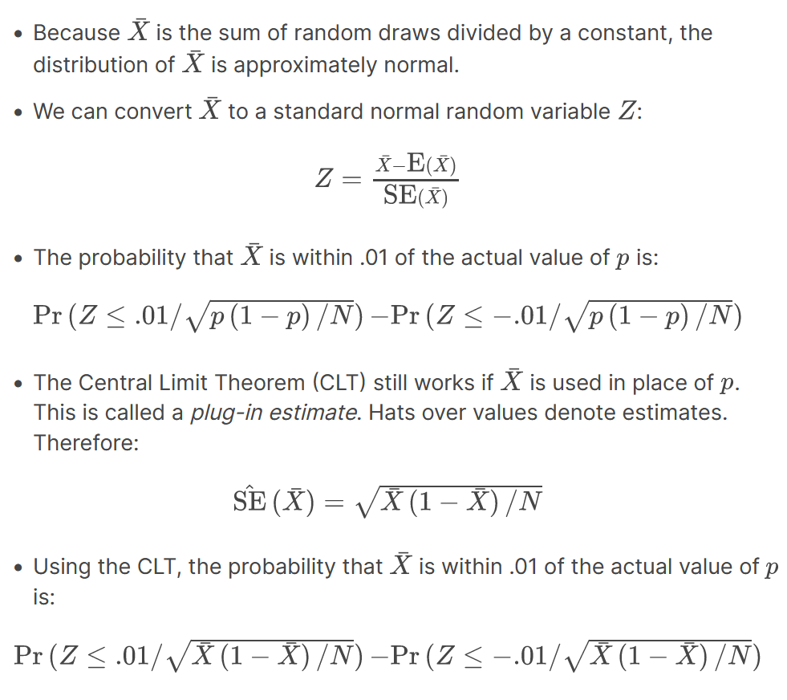

plug-in estimate

### Code: Computing the probability of Xbar being within .01 of p

```{r}
X_hat <- 0.48
se <- sqrt(X_hat*(1-X_hat)/25)
pnorm(0.01/se) - pnorm(-0.01/se)
```

### Margin of Error

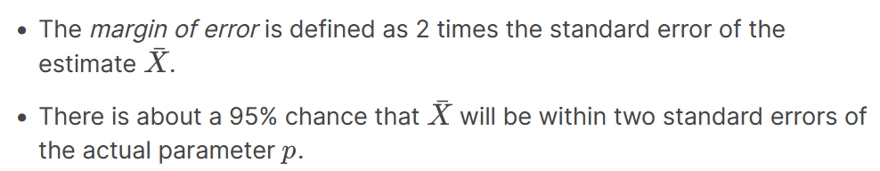

### A Monte Carlo Simulation for the CLT

-   We can run Monte Carlo simulations to compare with theoretical results assuming a value of p.

<!-- -->

-   In practice, is unknown. We can corroborate theoretical results by running Monte Carlo simulations with one or several values of p.

We don't know p, but we could run it for various values of p and sample sizes N and see that the theory works well for most values.

-   One practical choice for p when modeling is Xbar, the observed value of in a sample Xhat.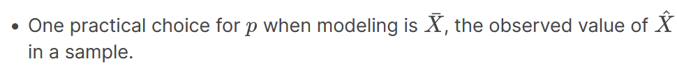

### Code: Monte Carlo simulation using a set value of p

```{r}
p <- 0.45    # unknown p to estimate
N <- 1000

# simulate one poll of size N and determine x_hat
x <- sample(c(0,1), size = N, replace = TRUE, prob = c(1-p, p))
x_hat <- mean(x)

# simulate B polls of size N and determine average x_hat
B <- 10000    # number of replicates
N <- 1000    # sample size per replicate
x_hat <- replicate(B, {
    x <- sample(c(0,1), size = N, replace = TRUE, prob = c(1-p, p))
    mean(x)
})
```

### Code: Histogram and QQ-plot of Monte Carlo results

```{r}
library(tidyverse)
library(gridExtra)
p1 <- data.frame(x_hat = x_hat) %>%
    ggplot(aes(x_hat)) +
    geom_histogram(binwidth = 0.005, color = "black")
p2 <- data.frame(x_hat = x_hat) %>%
    ggplot(aes(sample = x_hat)) +
    stat_qq(dparams = list(mean = mean(x_hat), sd = sd(x_hat))) +
    geom_abline() +
    ylab("X_hat") +
    xlab("Theoretical normal")
grid.arrange(p1, p2, nrow=1)
```

### The Spread

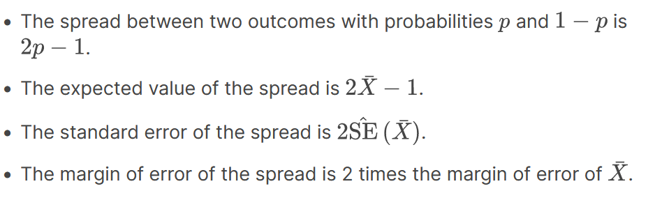

### Bias: Why Not Run a Very Large Poll?

-   An extremely large poll would theoretically be able to predict election results almost perfectly.

-   These sample sizes are not practical. In addition to cost concerns, polling doesn't reach everyone in the population (eventual voters) with equal probability, and it also may include data from outside our population (people who will not end up voting).

-   These systematic errors in polling are called *bias*. We will learn more about bias in the future.

### Code: Plotting margin of error in an extremely large poll over a range of values of p

```{r}
library(tidyverse)
N <- 100000
p <- seq(0.35, 0.65, length = 100)
SE <- sapply(p, function(x) 2*sqrt(x*(1-x)/N))
data.frame(p = p, SE = SE) %>%
    ggplot(aes(p, SE)) +
    geom_line()
```

# Assessment 2.1: Introduction to Inference

## Exercise 1. Sample average

Write function called `take_sample` that takes the proportion of Democrats p and the sample size N as arguments and returns the sample average of Democrats (1) and Republicans (0).

Calculate the sample average if the proportion of Democrats equals 0.45 and the sample size is 100.

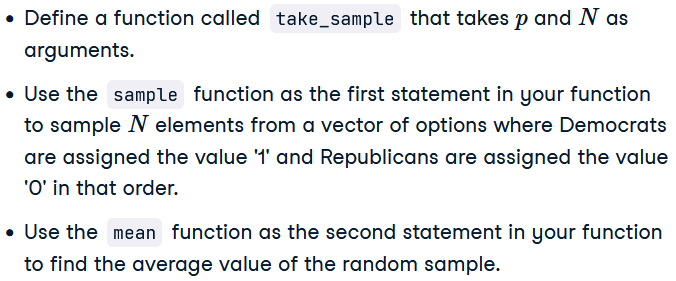

```{r}
# Write a function called `take_sample` that takes `p` and `N` as arguements and returns the average value of a randomly sampled population.
take_sample <- function(p,N){
    sim <- sample(c(1,0), N, replace = TRUE, prob = c(p, 1-p))   
    mean(sim)
}

# Use the `set.seed` function to make sure your answer matches the expected result after random sampling
set.seed(1)

# Define `p` as the proportion of Democrats in the population being polled
p <- 0.45

# Define `N` as the number of people polled
N <- 100

# Call the `take_sample` function to determine the sample average of `N` randomly selected people from a population containing a proportion of Democrats equal to `p`. Print this value to the console.
take_sample(p, N)
```

## Exercise 2. Distribution of errors - 1

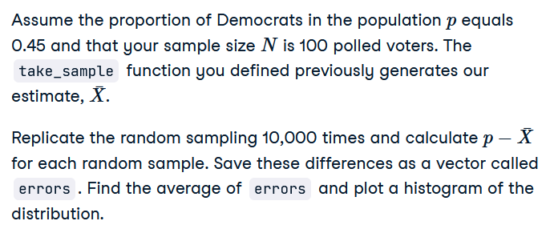

-   The function `take_sample` that you defined in the previous exercise has already been run for you.

<!-- -->

-   Use the `replicate` function to replicate subtracting the result of `take_sample` from the value of p 10,000 times.

<!-- -->

-   Use the `mean` function to calculate the average of the differences between the sample average and actual value of p.

```{r}
# Define `p` as the proportion of Democrats in the population being polled
p <- 0.45

# Define `N` as the number of people polled
N <- 100

# The variable `B` specifies the number of times we want the sample to be replicated
B <- 10000

# Use the `set.seed` function to make sure your answer matches the expected result after random sampling
set.seed(1)

# Create an objected called `errors` that replicates subtracting the result of the `take_sample` function from `p` for `B` replications
errors <- replicate(B, {
    differences <- p - take_sample(p,N)
    differences
})

# Calculate the mean of the errors. Print this value to the console.
mean(errors)
```

## Exercise 3. Distribution of errors - 2

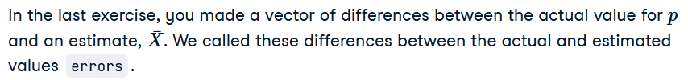

The `errors` object has already been loaded for you. Use the `hist` function to plot a histogram of the values contained in the vector `errors`. Which statement best describes the distribution of the errors?

](images/clipboard-3251208375.png)

## Exercise 4. Average size of error

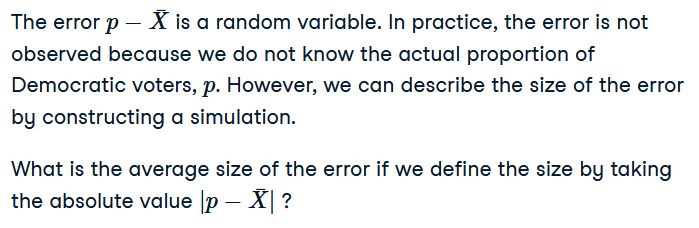

```{r}
# Define `p` as the proportion of Democrats in the population being polled
p <- 0.45

# Define `N` as the number of people polled
N <- 100

# The variable `B` specifies the number of times we want the sample to be replicated
B <- 10000

# Use the `set.seed` function to make sure your answer matches the expected result after random sampling
set.seed(1)

# We generated `errors` by subtracting the estimate from the actual proportion of Democratic voters
errors <- replicate(B, p - take_sample(p, N))

# Calculate the mean of the absolute value of each simulated error. Print this value to the console.
mean(abs(errors))

```

## Exercise 5. Standard deviation of the spread

The standard error is related to the typical **size** of the error we make when predicting. We say **size** because, as we just saw, the errors are centered around 0. In that sense, the typical error is 0. For mathematical reasons related to the central limit theorem, we actually use the standard deviation of `errors` rather than the average of the absolute values.

```{r}
# Define `p` as the proportion of Democrats in the population being polled
p <- 0.45

# Define `N` as the number of people polled
N <- 100

# The variable `B` specifies the number of times we want the sample to be replicated
B <- 10000

# Use the `set.seed` function to make sure your answer matches the expected result after random sampling
set.seed(1)

# We generated `errors` by subtracting the estimate from the actual proportion of Democratic voters
errors <- replicate(B, p - take_sample(p, N))

# Calculate the standard deviation of `errors`
sqrt(mean((errors)^2))

```

## Exercise 6. Estimating the standard error

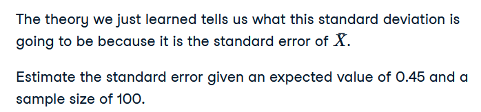

-   Calculate the standard error using the `sqrt` function

```{r}
# Define `p` as the expected value equal to 0.45
p <- 0.45

# Define `N` as the sample size
N <- 100

# Calculate the standard error
sqrt(p*(1-p)/N)
```

## Exercise 7. Standard error of the estimate

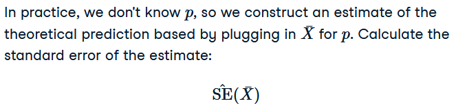

-   Simulate a poll `X` using the `sample` function.

-   When using the `sample` function, create a vector using `c()` that contains all possible polling options where '1' indicates a Democratic voter and '0' indicates a Republican voter.

-   When using the `sample` function, use `replace = TRUE` within the `sample` function to indicate that sampling from the vector should occur with replacement.

-   When using the `sample` function, use `prob =` within the `sample` function to indicate the probabilities of selecting either element (0 or 1) within the vector of possibilities.

-   Use the `mean` function to calculate the average of the simulated poll, `X_bar`.

-   Calculate the standard error of the `X_bar` using the `sqrt` function and print the result.

```{r}
# Define `p` as a proportion of Democratic voters to simulate
p <- 0.45

# Define `N` as the sample size
N <- 100

# Use the `set.seed` function to make sure your answer matches the expected result after random sampling
set.seed(1)

# Define `X` as a random sample of `N` voters with a probability of picking a Democrat ('1') equal to `p`
X <- sample(c(1,0), N, replace = TRUE, prob = c(p, 1-p))
X
# Define `X_bar` as the average sampled proportion
X_bar <- mean(X)
X_bar
# Calculate the standard error of the estimate. Print the result to the console.
sqrt((X_bar * (1-X_bar))/N)

```

## Exercise 8. Plotting the standard error

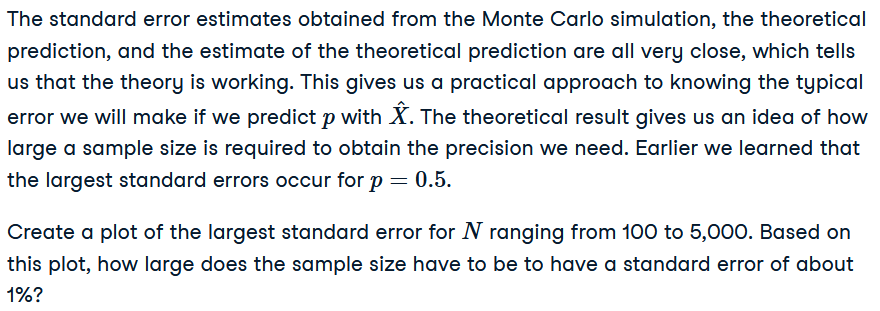

```{r}
N <- seq(100, 5000, len = 100)
p <- 0.5
se <- sqrt(p*(1-p)/N)
plot(se, N)
```

](images/clipboard-1973722717.png)

## Exercise 9. Distribution of X-hat


## Exercise 10. Distribution of the errors

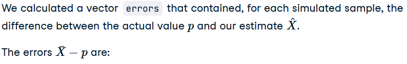

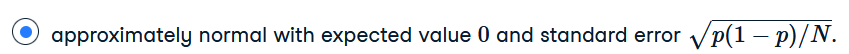

## Exercise 11. Plotting the errors

Make a qq-plot of the `errors` you generated previously to see if they follow a normal distribution.

-   Run the supplied code

-   Use the `qqnorm` function to produce a qq-plot of the errors.

-   Use the `qqline` function to plot a line showing a normal distribution.

```{r}
# Define `p` as the proportion of Democrats in the population being polled
p <- 0.45

# Define `N` as the number of people polled
N <- 100

# The variable `B` specifies the number of times we want the sample to be replicated
B <- 10000

# Use the `set.seed` function to make sure your answer matches the expected result after random sampling
set.seed(1)

# Generate `errors` by subtracting the estimate from the actual proportion of Democratic voters
errors <- replicate(B, p - take_sample(p, N))

# Generate a qq-plot of `errors` with a qq-line showing a normal distribution
qqnorm(errors)
qqline(errors)
```

## Exercise 12. Estimating the probability of a specific value of X-bar

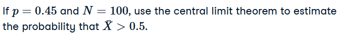

-   Use `pnorm` to define the probability that a value will be greater than 0.5.

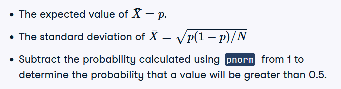

```{r}
# Define `p` as the proportion of Democrats in the population being polled
p <- 0.45

# Define `N` as the number of people polled
N <- 100

# Calculate the probability that the estimated proportion of Democrats in the population is greater than 0.5. Print this value to the console.
1-pnorm(0.5, p, sqrt(p*(1-p)/N))
```

## Exercise 13. Estimating the probability of a specific error size

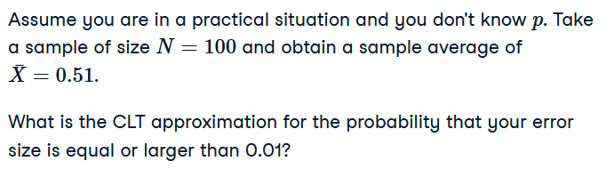

-   Calculate the standard error of the sample average using the `sqrt` function.

-   Use `pnorm` twice to define the probabilities that a value will be less than -0.01 or greater than 0.01.

-   Combine these results to calculate the probability that the error *size* will be 0.01 or larger.

```{r}
# Define `N` as the number of people polled
N <-100

# Define `X_hat` as the sample average
X_hat <- 0.51

# Define `se_hat` as the standard error of the sample average
se_hat <- sqrt(X_hat*(1-X_hat)/N)

# Calculate the probability that the error is 0.01 or larger
1-(pnorm(0.01/se_hat) - pnorm(-0.01/se_hat))
```

Note: CLT works if Xbar i used in place of p. Plug-in estimate.

# Section 3 Overview

In Section 3, you will look at confidence intervals and p-values.

After completing Section 3, you will be able to:

-   Calculate confidence intervals of difference sizes around an estimate.

-   Understand that a confidence interval is a random interval with the given probability of falling on top of the parameter.

-   Explain the concept of "power" as it relates to inference.

-   Understand the relationship between p-values and confidence intervals and explain why reporting confidence intervals is often preferable.

## Confidence Intervals

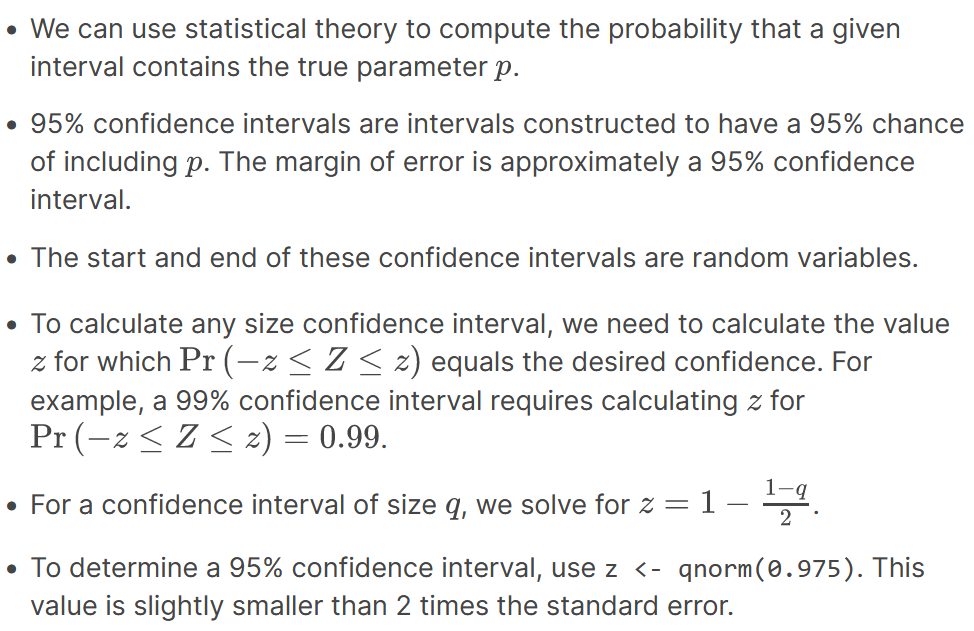

### Code: geom_smooth confidence interval example

The shaded area around the curve is related to the concept of confidence intervals.

```{r}
library(dplyr)
library(dslabs)
library(ggplot2)
data("nhtemp")
data.frame(year = as.numeric(time(nhtemp)), temperature = as.numeric(nhtemp)) %>%
    ggplot(aes(year, temperature)) +
    geom_point() +
    geom_smooth() +
    ggtitle("Average Yearly Temperatures in New Haven")
```

### Code: Monte Carlo simulation of confidence intervals

Note that to compute the exact 95% confidence interval, we would use qnorm(.975)\*SE_hat instead of 2\*SE_hat.

```{r}
p <- 0.45
N <- 1000
X <- sample(c(0,1), size = N, replace = TRUE, prob = c(1-p, p))    # generate N observations
X_hat <- mean(X)    # calculate X_hat
SE_hat <- sqrt(X_hat*(1-X_hat)/N)    # calculate SE_hat, SE of the mean of N observations
c(X_hat - 2*SE_hat, X_hat + 2*SE_hat)    # build interval of 2*SE above and below mean
```

### Code: Solving for z with `qnorm`

```{r}
z <- qnorm(0.995)    # calculate z to solve for 99% confidence interval
pnorm(qnorm(0.995))    # demonstrating that qnorm gives the z value for a given probability
pnorm(qnorm(1-0.995))    # demonstrating symmetry of 1-qnorm
pnorm(z) - pnorm(-z)    # demonstrating that this z value gives correct probability for interval
```

## A Visual Clarification of Confidence Intervals


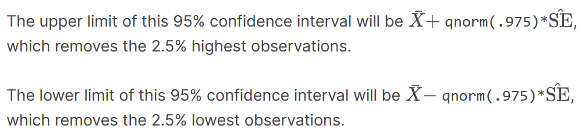](images/ci95.png)

## A Monte Carlo Simulation for Confidence Intervals

-   We can run a Monte Carlo simulation to confirm that a 95% confidence interval contains the true value of p 95% of the time.

-   A plot of confidence intervals from this simulation demonstrates that most intervals include p, but roughly 5% of intervals miss the true value of p.

### Code: Monte Carlo simulation

Note that to compute the exact 95% confidence interval, we would use `qnorm(.975)*SE_hat` instead of`2*SE_hat`.

```{r}
B <- 10000
inside <- replicate(B, {
    X <- sample(c(0,1), size = N, replace = TRUE, prob = c(1-p, p))
    X_hat <- mean(X)
    SE_hat <- sqrt(X_hat*(1-X_hat)/N)
    between(p, X_hat - 2*SE_hat, X_hat + 2*SE_hat)    # TRUE if p in confidence interval
})
mean(inside)
```

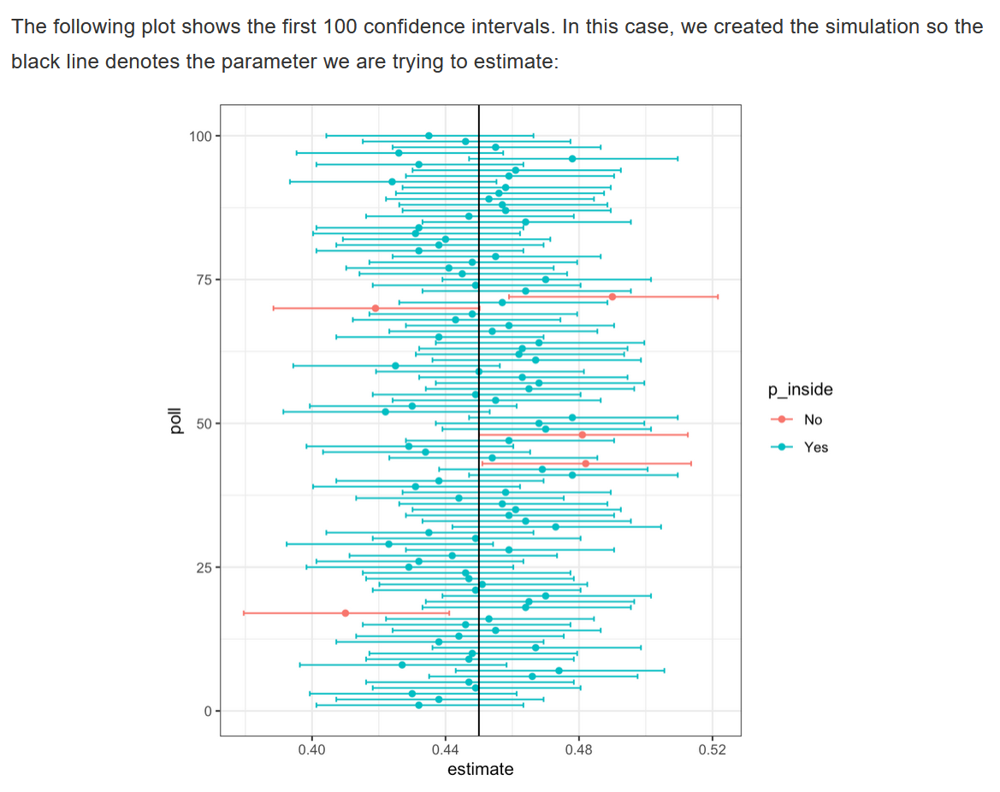

## The Correct Language

-   The 95% confidence intervals are random, but p is not random.

-   95% refers to the probability that the random interval falls on top of p.

-   It is technically incorrect to state that p has a 95% chance of being in between two values because that implies p is random.

## Power

-   If we are trying to predict the result of an election, then a confidence interval that includes a spread of 0 (a tie) is not helpful.

-   A confidence interval that includes a spread of 0 does not imply a close election, it means the sample size is too small.

-   Power is the probability of detecting an effect when there is a true effect to find. Power increases as sample size increases, because larger sample size means smaller standard error.

### Code: Confidence interval for the spread with sample size of 25

Note that to compute the exact 95% confidence interval, we would use `c(-qnorm(.975), qnorm(.975))` instead of 1.96.

```{r}
N <- 25
X_hat <- 0.48
(2*X_hat - 1) + c(-2, 2)*2*sqrt(X_hat*(1-X_hat)/N)
```

## p-Values

-   The null hypothesis is the hypothesis that there is no effect. In this case, the null hypothesis is that the spread is 0, or p=0.5.
-   The p-value is the probability of detecting an effect of a certain size or larger when the null hypothesis is true.
-   We can convert the probability of seeing an observed value under the null hypothesis into a standard normal random variable. We compute the value of that corresponds to the observed result, and then use that to compute the p-value.
-   If a 95% confidence interval does not include our observed value, then the p-value must be smaller than 0.05.
-   It is preferable to report confidence intervals instead of p-values, as confidence intervals give information about the size of the estimate and p-values do not.

### Code: Computing a p-value for observed spread of 0.02

```{r}
N <- 100    # sample size
z <- sqrt(N) * 0.02/0.5    # spread of 0.02
1 - (pnorm(z) - pnorm(-z))
```

## Another Explanation of p-Values

The p-value is the probability of observing a value as extreme or more extreme than the result given that the null hypothesis is true.

In the context of the normal distribution, this refers to the probability of observing a Z-score whose absolute value is as high or higher than the Z-score of interest.

Suppose we want to find the p-value of an observation 2 standard deviations larger than the mean. This means we are looking for anything with 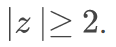{width="42"}.

Graphically, the p-value gives the probability of an observation that's at least as far away from the mean or further. This plot shows a standard normal distribution (centered at z=0 with a standard deviation of 1). The shaded tails are the region of the graph that are 2 standard deviations or more away from the mean.


Recall that, by default, `pnorm()` gives the CDF for a normal distribution with a mean of 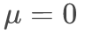{width="36" height="17"} and standard deviation of {width="36" height="12"}. To find p-values for a given z-score `z` in a normal distribution with mean mu and standard deviation `sigma,` use `2*(1-pnorm(z, mu, sigma))` instead.

# Assessment 3.1: Confidence Intervals and p-Values

## Exercise 1. Confidence interval for p

For the following exercises, we will use actual poll data from the 2016 election. The exercises will contain pre-loaded data from the `dslabs` package.

```{r}
library(dslabs)
data("polls_us_election_2016")
```

We will use all the national polls that ended within a few weeks before the election.

Assume there are only two candidates and construct a 95% confidence interval for the election night proportion p.

-   Use `filter` to subset the data set for the poll data you want. Include polls that ended on or after October 31, 2016 (`enddate`). Only include polls that took place in the United States. Call this filtered object `polls`.

-   Use `nrow` to make sure you created a filtered object `polls` that contains the correct number of rows.

-   Extract the sample size `N` from the first poll in your subset object `polls`.

-   Convert the percentage of Clinton voters (`rawpoll_clinton`) from the first poll in `polls` to a proportion, `X_hat`. Print this value to the console.

-   Find the standard error of `X_hat` given `N`. Print this result to the console.

-   Calculate the 95% confidence interval of this estimate using the `qnorm` function.

-   Save the lower and upper confidence intervals as an object called `ci`. Save the lower confidence interval first.

```{r}
# Load the data
library(dslabs)
library(dplyr)
data(polls_us_election_2016)
head(polls_us_election_2016)

# Generate an object `polls` that contains data filtered for polls that ended on or after October 31, 2016 in the United States
polls <- polls_us_election_2016 %>% filter(enddate >= "2016-10-31" & state == "U.S.")

# How many rows does `polls` contain? Print this value to the console.
nrow(polls)

# Assign the sample size of the first poll in `polls` to a variable called `N`. Print this value to the console.
N <- polls$samplesize[1]
N

# For the first poll in `polls`, assign the estimated percentage of Clinton voters to a variable called `X_hat`. Print this value to the console.
X_hat <- polls$rawpoll_clinton[1]/100
X_hat

# Calculate the standard error of `X_hat` and save it to a variable called `se_hat`. Print this value to the console.
se_hat <- sqrt(X_hat * (1-X_hat)/N)

# Use `qnorm` to calculate the 95% confidence interval for the proportion of Clinton voters. Save the lower and then the upper confidence interval to a variable called `ci`.
ci <- c(X_hat - qnorm(0.975)*se_hat, X_hat + qnorm(0.975)*se_hat)
ci
```

## Exercise 2. Pollster results for p

Create a new object called `pollster_results` that contains the pollster's name, the end date of the poll, the proportion of voters who declared a vote for Clinton, the standard error of this estimate, and the lower and upper bounds of the confidence interval for the estimate.

-   Use the `mutate` function to define four new columns: `X_hat`, `se_hat`, `lower`, and `upper`. Temporarily add these columns to the `polls` object that has already been loaded for you.

-   In the `X_hat` column, convert the raw poll results for Clinton to a proportion.

-   In the `se_hat` column, calculate the standard error of `X_hat` for each poll using the `sqrt` function.

-   In the `lower` column, calculate the lower bound of the 95% confidence interval using the `qnorm` function.

-   In the `upper` column, calculate the upper bound of the 95% confidence interval using the `qnorm` function.

-   Use the `select` function to select the columns from `polls` to save to the new object `pollster_results`.

```{r}
# The `polls` object that filtered all the data by date and nation has already been loaded. Examine it using the `head` function.
head(polls)

# Create a new object called `pollster_results` that contains columns for pollster name, end date, X_hat, se_hat, lower confidence interval, and upper confidence interval for each poll.
pollster_results <- polls %>%
  mutate(X_hat = polls$rawpoll_clinton/100,
         se_hat = sqrt(X_hat*(1-X_hat)/samplesize),
         lower = X_hat - qnorm(0.975)*se_hat,
         upper = X_hat + qnorm(0.975)*se_hat) %>%
  select(pollster, enddate, X_hat, se_hat, lower, upper)


pollster_results
```

## Exercise 3. Comparing to actual results - p

The final tally for the popular vote was Clinton 48.2% and Trump 46.1%. Add a column called `hit` to `pollster_results` that states if the confidence interval included the true proportion p=0.482 or not. What proportion of confidence intervals included p?

-   Use the `mutate` function to define a new variable called ‘hit’.

-   Use logical expressions to determine if each values in `lower` and `upper` span the actual proportion.

-   Use the `mean` function to determine the average value in `hit` and `summarize` the results using summarize.

-   Save the result as an object called `avg_hit`.

```{r}
# The `pollster_results` object has already been loaded. Examine it using the `head` function.
head(pollster_results)

# Add a logical variable called `hit` that indicates whether the actual value exists within the confidence interval of each poll. Summarize the average `hit` result to determine the proportion of polls with confidence intervals include the actual value. Save the result as an object called `avg_hit`.
p <- rep(0.482, 70)
avg_hit <- pollster_results %>%
  mutate(hit = between(p, lower, upper)) %>%
  summarize(mean(hit))
avg_hit

#or
avg_hit <- pollster_results %>% mutate(hit=(lower<0.482 & upper>0.482)) %>% summarize(mean(hit))
avg_hit
```

## Exercise 4. Theory of confidence intervals

If these confidence intervals are constructed correctly, and the theory holds up, what proportion of confidence intervals should include p?

Ans. 0.95

They were made using the margin of error...

## Exercise 5. Confidence interval for d

A much smaller proportion of the polls than expected produce confidence intervals containing p. Notice that most polls that fail to include p are underestimating. The rationale for this is that undecided voters historically divide evenly between the two main candidates on election day.

In this case, it is more informative to estimate the spread or the difference between the proportion of two candidates d, or 0.482−0.461=0.021 for this election.

Assume that there are only two parties and that  d=2p−1. Construct a 95% confidence interval for difference in proportions on election night.

-   Use the `mutate` function to define a new variable called ‘d_hat’ in `polls`. The new variable subtract the proportion of Trump voters from the proportion of Clinton voters.

-   Extract the sample size `N` from the first poll in your subset object `polls`.

-   Extract the difference in proportions of voters `d_hat` from the first poll in your subset object polls.

-   Use the formula above to calculate p from `d_hat`. Assign p to the variable `X_hat`.

-   Find the standard error of the spread given `N`.

-   Calculate the 95% confidence interval of this estimate of the difference in proportions, `d_hat`, using the `qnorm` function.

-   Save the lower and upper confidence intervals as an object called `ci`. Save the lower confidence interval first.

```{r}
# Add a statement to this line of code that will add a new column named `d_hat` to `polls`. The new column should contain the difference in the proportion of voters.
polls <- polls_us_election_2016 %>% filter(enddate >= "2016-10-31" & state == "U.S.") %>% mutate(d_hat = rawpoll_clinton/100 - rawpoll_trump/100)


# Assign the sample size of the first poll in `polls` to a variable called `N`. Print this value to the console.
N <- polls$samplesize[1]
N

# Assign the difference `d_hat` of the first poll in `polls` to a variable called `d_hat`. Print this value to the console.
d_hat <- polls$d_hat[1]
d_hat

# Assign proportion of votes for Clinton to the variable `X_hat`.
X_hat <- (d_hat+1)/2
X_hat

# Calculate the standard error of the spread and save it to a variable called `se_hat`. Print this value to the console.
se_hat <- 2*sqrt(X_hat*(1-X_hat)/N)
se_hat 

# Use `qnorm` to calculate the 95% confidence interval for the difference in the proportions of voters. Save the lower and then the upper confidence interval to a variable called `ci`.
ci <- c(d_hat - qnorm(0.975)*se_hat, d_hat + qnorm(0.975)*se_hat)
ci
```

## Exercise 6. Pollster results for d

Create a new object called `pollster_results` that contains the pollster's name, the end date of the poll, the difference in the proportion of voters who declared a vote either, and the lower and upper bounds of the confidence interval for the estimate.

-   Use the `mutate` function to define four new columns: 'X_hat', 'se_hat', 'lower', and 'upper'. Temporarily add these columns to the `polls` object that has already been loaded for you.

-   In the `X_hat` column, calculate the proportion of voters for Clinton using `d_hat`.

-   In the `se_hat` column, calculate the standard error of the spread for each poll using the `sqrt` function.

-   In the `lower` column, calculate the lower bound of the 95% confidence interval using the `qnorm` function.

-   In the `upper` column, calculate the upper bound of the 95% confidence interval using the `qnorm` function.

-   Use the `select` function to select the `pollster, enddate, d_hat, lower, upper` columns from `polls` to save to the new object `pollster_results`.

```{r}
pollster_results <- polls %>%
  mutate(
    X_hat = (d_hat+1)/2,
    se_hat = sqrt(X_hat*(1-X_hat)/.$samplesize),
    lower = d_hat - qnorm(0.975)*se_hat,
    upper = d_hat + qnorm(0.975)*se_hat
  ) %>%
  select(pollster, enddate, d_hat, lower, upper)
pollster_results
```

## Exercise 7. Comparing to actual results - d

What proportion of confidence intervals for the difference between the proportion of voters included d, the actual difference in election day?

-   Use the `mutate` function to define a new variable within`pollster_results` called hit.

-   Use logical expressions to determine if each values in `lower` and `upper` span the actual difference in proportions of voters.

-   Use the `mean` function to determine the average value in `hit` and summarize the results using `summarize`.

-   Save the result as an object called `avg_hit`.

```{r}
# The `pollster_results` object has already been loaded. Examine it using the `head` function.
head(pollster_results)

# Add a logical variable called `hit` that indicates whether the actual value (0.021) exists within the confidence interval of each poll. Summarize the average `hit` result to determine the proportion of polls with confidence intervals include the actual value. Save the result as an object called `avg_hit`.
avg_hit <- pollster_results %>% 
  mutate(hit=(lower<0.021 & upper>0.021)) %>%
  summarize(mean(hit))

avg_hit
```

## Exercise 8. Comparing to actual results by pollster

Although the proportion of confidence intervals that include the actual difference between the proportion of voters increases substantially, it is still lower that 0.95. In the next chapter, we learn the reason for this.

-   Define a new variable `errors` that contains the difference between the estimated difference between the proportion of voters and the actual difference on election day, 0.021.

-   To create the plot of errors by pollster, add a layer with the function `geom_point`. The aesthetic mappings require a definition of the x-axis and y-axis variables. So the code looks like the example below, but you fill in the variables for x and y.

-   The last line of the example code adjusts the x-axis labels so that they are easier to read.

```{r}
# The `polls` object has already been loaded. Examine it using the `head` function.
head(polls)
library(ggplot2)

# Add variable called `error` to the object `polls` that contains the difference between d_hat and the actual difference on election day. Then make a plot of the error stratified by pollster.
polls %>% 
  mutate(error = d_hat - 0.021) %>%
  ggplot(aes(x = pollster, y = error)) +
  geom_point() +
  theme(axis.text.x = element_text(angle = 90, hjust = 1))

```

## Exercise 9. Comparing to actual results by pollster - multiple polls

Remake the plot you made for the previous exercise, but only for pollsters that took five or more polls.

You can use dplyr tools `group_by` and `n` to group data by a variable of interest and then count the number of observations in the groups. The function `filter` filters data piped into it by your specified condition.

For example:

```{r}
data %>% group_by(variable_for_grouping) 
    %>% filter(n() >= 5)
```

-   Define a new variable `errors` that contains the difference between the estimated difference between the proportion of voters and the actual difference on election day, 0.021.

-   Group the data by pollster using the `group_by` function.

-   Filter the data by pollsters with 5 or more polls.

-   Use `ggplo`t to create the plot of errors by pollster.

-   Add a layer with the function `geom_point`.

```{r}
# The `polls` object has already been loaded. Examine it using the `head` function.
head(polls)

# Add variable called `error` to the object `polls` that contains the difference between d_hat and the actual difference on election day. Then make a plot of the error stratified by pollster, but only for pollsters who took 5 or more polls.
polls %>% 
  mutate(error = d_hat - 0.021) %>%
  group_by(pollster) %>%
  filter(n() >= 5) %>%
  ggplot(aes(x = pollster, y = error)) +
  geom_point() +
  theme(axis.text.x = element_text(angle = 90, hjust = 1))
```

# Section 4 Overview

In Section 4, you will look at statistical models in the context of election polling and forecasting.

After completing Section 4, you will be able to:

-   Understand how aggregating data from different sources, as poll aggregators do for poll data, can improve the precision of a prediction

-   Understand how to fit a multilevel model to the data to forecast, for example, election results.

-   Explain why a simple aggregation of data is insufficient to combine results because of factors such as pollster bias.

-   Use a data-driven model to account for additional types of sampling variability such as pollster-to-pollster variability.

### Poll Aggregators

-   Poll aggregators combine the results of many polls to simulate polls with a large sample size and therefore generate more precise estimates than individual polls.

-   Polls can be simulated with a Monte Carlo simulation and used to construct an estimate of the spread and confidence intervals.

-   The actual data science exercise of forecasting elections involves more complex statistical modeling, but these underlying ideas still apply.

#### Code: Simulating polls

Note that to compute the exact 95% confidence interval, we would use `qnorm(.975)*SE_hat` instead of `2*SE_hat`.

```{r}
d <- 0.039
Ns <- c(1298, 533, 1342, 897, 774, 254, 812, 324, 1291, 1056, 2172, 516)
p <- (d+1)/2

# calculate confidence intervals of the spread
confidence_intervals <- sapply(Ns, function(N){
    X <- sample(c(0,1), size=N, replace=TRUE, prob = c(1-p, p))
    X_hat <- mean(X)
    SE_hat <- sqrt(X_hat*(1-X_hat)/N)
    2*c(X_hat, X_hat - 2*SE_hat, X_hat + 2*SE_hat) - 1
})

# generate a data frame storing results
polls <- data.frame(poll = 1:ncol(confidence_intervals),
                    t(confidence_intervals), sample_size = Ns)
names(polls) <- c("poll", "estimate", "low", "high", "sample_size")
polls
```

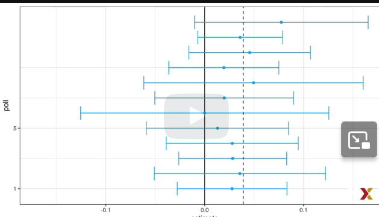

dashed line is actual election outcome

solid line is 0

#### Code: Calculating the spread of combined polls

Note that to compute the exact 95% confidence interval, we would use `qnorm(.975)` instead of 1.96.

In this case, d is an estimate of the spread.

```{r}
library(dplyr)
sum(polls$sample_size)
d_hat <- polls %>%
    summarize(avg = sum(estimate*sample_size) / sum(sample_size)) %>%
    .$avg

p_hat <- (1+d_hat)/2
moe <- 2*1.96*sqrt(p_hat*(1-p_hat)/sum(polls$sample_size))   
round(d_hat*100,1)
round(moe*100, 1)
```

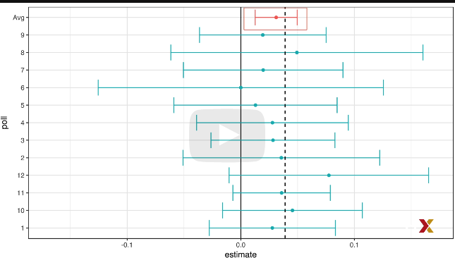

### Pollsters and Multilevel Models

-   Different poll aggregators generate different models of election results from the same poll data. This is because they use different statistical models.

-   We will use actual polling data about the popular vote from the 2016 US presidential election to learn the principles of statistical modeling.

### Poll Data and Pollster Bias

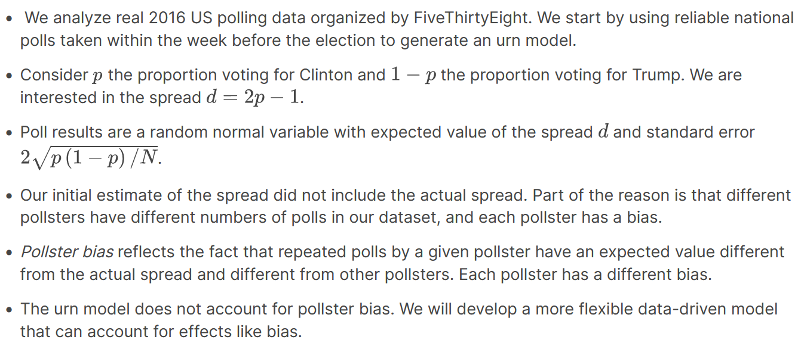

-   *Pollster bias* reflects the fact that repeated polls by a given pollster have an expected value different from the actual spread and different from other pollsters. Each pollster has a different bias.

-   The urn model does not account for pollster bias. We will develop a more flexible data-driven model that can account for effects like bias.

#### Code: Generating simulated poll data

```{r}
library(dslabs)
library(ggplot2)
data(polls_us_election_2016)
names(polls_us_election_2016)

# keep only national polls from week before election with a grade considered reliable
polls <- polls_us_election_2016 %>%
    filter(state == "U.S." & enddate >= "2016-10-31" &
               (grade %in% c("A+", "A", "A-", "B+") | is.na(grade)))

# add spread estimate
polls <- polls %>%
    mutate(spread = rawpoll_clinton/100 - rawpoll_trump/100)

# compute estimated spread for combined polls
d_hat <- polls %>%
    summarize(d_hat = sum(spread * samplesize) / sum(samplesize)) %>%
    .$d_hat

# compute margin of error
p_hat <- (d_hat+1)/2
moe <- 1.96 * 2 * sqrt(p_hat*(1-p_hat)/sum(polls$samplesize))

# histogram of the spread
polls %>%
    ggplot(aes(spread)) +
    geom_histogram(color="black", binwidth = .01)
```

The data does not appear to be normally distributed and the spread moe seems to be larger than what the simulation suggests.

#### Code: Investigating poll data and pollster bias

```{r}
# number of polls per pollster in week before election
polls %>% group_by(pollster) %>% summarize(n())

# plot results by pollsters with at least 6 polls
polls %>% group_by(pollster) %>%
    filter(n() >= 6) %>%
    ggplot(aes(pollster, spread)) +
    geom_point() +
    theme(axis.text.x = element_text(angle = 90, hjust = 1))

# standard errors within each pollster
polls %>% group_by(pollster) %>%
    filter(n() >= 6) %>%
    summarize(se = 2 * sqrt(p_hat * (1-p_hat) / median(samplesize)))
```

-   Our initial estimate of the spread did not include the actual spread. Part of the reason is that different pollsters have different numbers of polls in our dataset, and each pollster has a bias.

<!-- -->

-   *Pollster bias* reflects the fact that repeated polls by a given pollster have an expected value different from the actual spread and different from other pollsters. Each pollster has a different bias.

<!-- -->

-   The urn model does not account for pollster bias. We will develop a more flexible data-driven model that can account for effects like bias.

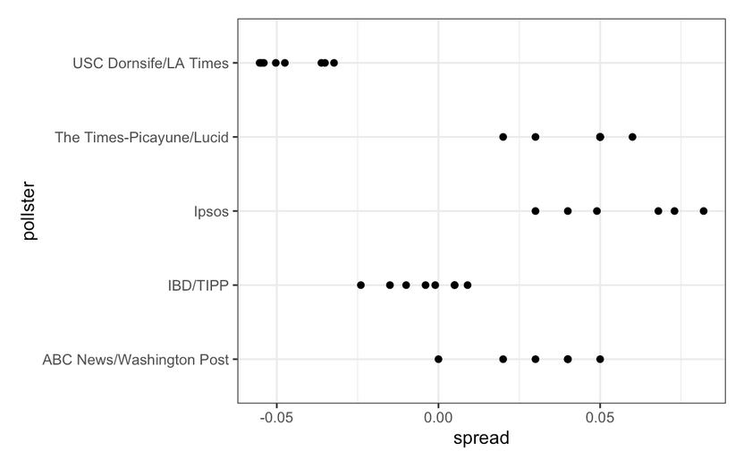

However, there appears to be differences *across the polls*. Note, for example, how the USC Dornsife/LA Times pollster is predicting a 4% win for Trump, while Ipsos is predicting a win larger than 5% for Clinton. The theory we learned says nothing about different pollsters producing polls with different expected values. All the polls should have the same expected value.

### Data-Driven Models

-   Instead of using an urn model where each poll is a random draw from the same distribution of voters, we instead define a model using an urn that contains poll results from all possible pollsters.

#### Code 

Note that to compute the exact 95% confidence interval, we would use `qnorm(.975)` instead of 1.96.

```{r}
# collect last result before the election for each pollster
one_poll_per_pollster <- polls %>% group_by(pollster) %>%
    filter(enddate == max(enddate)) %>%      # keep latest poll
    ungroup()

# histogram of spread estimates
one_poll_per_pollster %>%
    ggplot(aes(spread)) + geom_histogram(binwidth = 0.01)

# construct 95% confidence interval
results <- one_poll_per_pollster %>%
    summarize(avg = mean(spread), se = sd(spread)/sqrt(length(spread))) %>%
    mutate(start = avg - 1.96*se, end = avg + 1.96*se)
round(results*100, 1)
```

# Assessment 4.1: Statistical Models

## Exercise 1 - Heights Revisited

We have been using *urn models* to motivate the use of probability models. However, most data science applications are not related to data obtained from urns. More common are data that come from individuals. Probability plays a role because the data come from a random sample. The random sample is taken from a population and the urn serves as an analogy for the population.

Let's revisit the heights dataset. For now, consider `x` to be the heights of all males in the data set. Mathematically speaking, `x` is our population. Using the urn analogy, we have an urn with the values of `x` in it.

What are the population average and standard deviation of our population?

-   Execute the lines of code that create a vector `x` that contains heights for all males in the population.

-   Calculate the average of `x`.

-   Calculate the standard deviation of `x`.

```{r}
# Load the 'dslabs' package and data contained in 'heights'
library(dslabs)
data(heights)

# Make a vector of heights from all males in the population
x <- heights %>% filter(sex == "Male") %>%
  .$height

# Calculate the population average. Print this value to the console.
mean(x)

# Calculate the population standard deviation. Print this value to the console.
sd(x)
```

## Exercise 2 - Sample the population of heights

Call the population average computed above μ and the standard deviation σ. Now take a sample of size 50, with replacement, and construct an estimate for μ and σ.

-   Use the `sample` function to sample `N` values from `x`.

-   Calculate the mean of the sampled heights.

-   Calculate the standard deviation of the sampled heights.

```{r}
# The vector of all male heights in our population `x` has already been loaded for you. You can examine the first six elements using `head`.
head(x)

# Use the `set.seed` function to make sure your answer matches the expected result after random sampling
set.seed(1)

# Define `N` as the number of people measured
N <- 50

# Define `X` as a random sample from our population `x`
X <- sample(x, N, replace = TRUE)
X

# Calculate the sample average. Print this value to the console.
mean(X)

# Calculate the sample standard deviation. Print this value to the console.
sd(X)
```

## Exercise 3 - Sample and Population Averages

What does the central limit theory tell us about the sample average and how it is related to μ, the population average?

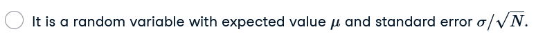

## Exercise 4 - Confidence Interval Calculation

We will use  X¯ as our estimate of the heights in the population from our sample size N. We know from previous exercises that the standard estimate of our error  X¯−μ is  σ/N−−√.

Construct a 95% confidence interval for μ.

-   Use the `sd` and `sqrt` functions to define the standard error `se`

-   Calculate the 95% confidence intervals using the `qnorm` function. Save the lower then the upper confidence interval to a variable called `ci`.

```{r}
# The vector of all male heights in our population `x` has already been loaded for you. You can examine the first six elements using `head`.
head(x)

# Use the `set.seed` function to make sure your answer matches the expected result after random sampling
set.seed(1)

# Define `N` as the number of people measured
N <- 50

# Define `X` as a random sample from our population `x`
X <- sample(x, N, replace = TRUE)

# Define `se` as the standard error of the estimate. Print this value to the console.
se <- sd(X)/sqrt(N)
se


# Construct a 95% confidence interval for the population average based on our sample. Save the lower and then the upper confidence interval to a variable called `ci`.
ci <- c(mean(X) - qnorm(0.975)*se, mean(X) + qnorm(0.975)*se)
ci

```

## Exercise 5 - Monte Carlo Simulation for Heights

Now run a Monte Carlo simulation in which you compute 10,000 confidence intervals as you have just done. What proportion of these intervals include μ?

-   Use the `replicate` function to replicate the sample code for `B <- 10000` simulations. Save the results of the replicated code to a variable called `res`. The replicated code should complete the following steps: -1. Use the `sample` function to sample `N` values from `x`. Save the sampled heights as a vector called `X`. -2. Create an object called `interval` that contains the 95% confidence interval for each of the samples. Use the same formula you used in the previous exercise to calculate this interval. -3. Use the `between` function to determine if μ is contained within the confidence interval of that simulation.

-   Finally, use the `mean` function to determine the proportion of results in `res` that contain mu.

```{r}
library(tidyverse)
# Define `mu` as the population average
mu <- mean(x)

# Use the `set.seed` function to make sure your answer matches the expected result after random sampling
set.seed(1)

# Define `N` as the number of people measured
N <- 50

# Define `B` as the number of times to run the model
B <- 10000

# Define an object `res` that contains a logical vector for simulated intervals that contain mu
res <- replicate(B,{
    X <- sample(x, N, replace = TRUE)
    se <- sd(X)/sqrt(N)
    interval <- c(mean(X) - qnorm(0.975)*se, mean(X) + qnorm(0.975)*se)
    between(mu, mean(X) - qnorm(0.975)*se, mean(X) + qnorm(0.975)*se)
})
res

# Calculate the proportion of results in `res` that include mu. Print this value to the console.
mean(res)
```

## Exercise 6 - Visualizing Polling Bias

In this section, we used visualization to motivate the presence of pollster bias in election polls. Here we will examine that bias more rigorously. Lets consider two pollsters that conducted daily polls and look at national polls for the month before the election.

Is there a poll bias? Make a plot of the spreads for each poll.

-   Use `ggplot` to plot the spread for each of the two pollsters.

-   Define the x- and y-axes usingusing `aes()` within the `ggplot` function.

-   Use `geom_boxplot` to make a boxplot of the data.

-   Use `geom_point` to add data points to the plot.

```{r}
# Load the libraries and data you need for the following exercises
library(dslabs)
library(dplyr)
library(ggplot2)
data("polls_us_election_2016")

# These lines of code filter for the polls we want and calculate the spreads
polls <- polls_us_election_2016 %>% 
  filter(pollster %in% c("Rasmussen Reports/Pulse Opinion Research","The Times-Picayune/Lucid") &
           enddate >= "2016-10-15" &
           state == "U.S.") %>% 
  mutate(spread = rawpoll_clinton/100 - rawpoll_trump/100) 

# Make a boxplot with points of the spread for each pollster
polls %>% ggplot(aes(pollster, spread)) +
  geom_boxplot() +
  geom_point()
  
```

## Exercise 7 - Defining Pollster Bias

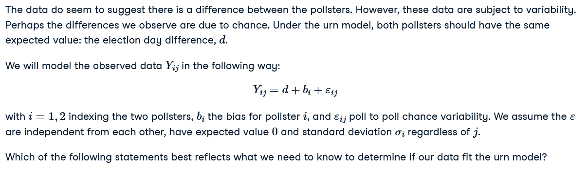

The data do seem to suggest there is a difference between the pollsters. However, these data are subject to variability. Perhaps the differences we observe are due to chance. Under the urn model, both pollsters should have the same expected value: the election day difference, d.

Which of the following statements best reflects what we need to know to determine if our data fit the urn model?

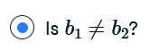

## Exercise 8 -  Derive Expected Value

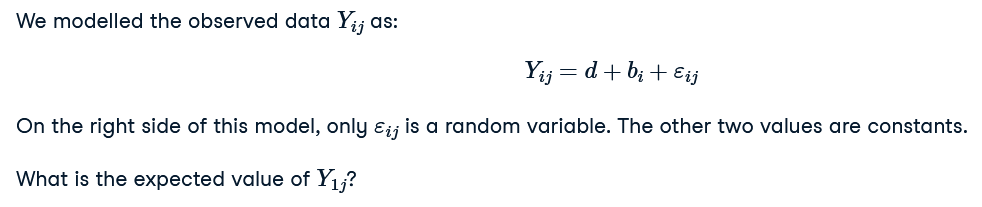

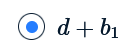

## Exercise 9 - Expected Value and Standard Error of Poll 1

](images/clipboard-3151239086.png)

## Exercise 10 - Expected Value and Standard Error of Poll 2


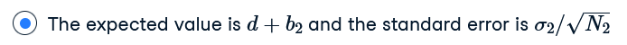

## Exercise 11 - Difference in Expected Values Between Polls


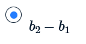

## Exercise 12 - Standard Error of the Difference Between Polls

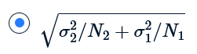

## Exercise 13 - Compute the Estimates


-   Group the data by pollster.

```{=html}
<!-- -->
```
-   Summarize the standard deviation of the spreads for each of the two pollsters. Name the standard deviation `s`.

```{=html}
<!-- -->
```
-   Store the pollster names and standard deviations of the spreads (

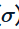) in an object called `sigma`.

```{r}
# The `polls` data have already been loaded for you. Use the `head` function to examine them.
head(polls)

# Create an object called `sigma` that contains a column for `pollster` and a column for `s`, the standard deviation of the spread
sigma <- polls %>%
  group_by(pollster) %>%
  summarize(s = sd(spread))

# Print the contents of sigma to the console
sigma
```

## Exercise 14 - Probability Distribution of the Spread

](images/clipboard-1101494716.png)

## Exercise 15 - Calculate the 95% Confidence Interval of the Spreads

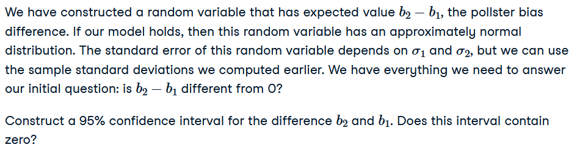

-   Use pipes `%>%` to pass the data `polls` on to functions that will group by pollster and summarize the average spread, standard deviation, and number of polls per pollster.

-   Calculate the estimate by subtracting the average spreads.

-   Calculate the standard error using the standard deviations of the spreads and the sample size.

-   Calculate the 95% confidence intervals using the `qnorm` function. Save the lower and then the upper confidence interval to a variable called `ci`.

```{r}
# The `polls` data have already been loaded for you. Use the `head` function to examine them.
head(polls)

# Create an object called `res` that summarizes the average, standard deviation, and number of polls for the two pollsters.
res <- polls %>%
  group_by(pollster) %>%
  summarize(avg = mean(spread), s = sd(spread), N = n())

# Store the difference between the larger average and the smaller in a variable called `estimate`. Print this value to the console.
estimate <- max(res$avg) - min(res$avg)
estimate

# Store the standard error of the estimates as a variable called `se_hat`. Print this value to the console.
se_hat <- sqrt(res$s[2]^2/res$N[2] + res$s[1]^2/res$N[1])
se_hat

# Calculate the 95% confidence interval of the spreads. Save the lower and then the upper confidence interval to a variable called `ci`.
ci <- c(estimate - qnorm(0.975)*se_hat, estimate + qnorm(0.975)*se_hat)
ci
```

## Exercise 16 - Calculate the P-value

The confidence interval tells us there is relatively strong pollster effect resulting in a difference of about 5%. Random variability does not seem to explain it.

Compute a p-value to relay the fact that chance does not explain the observed pollster effect.

-   Use the `pnorm` function to calculate the probability that a random value is larger than the observed ratio of the estimate to the standard error.

-   Multiply the probability by 2, because this is the two-tailed test.

```{r}
# We made an object `res` to summarize the average, standard deviation, and number of polls for the two pollsters.
res <- polls %>% group_by(pollster) %>% 
  summarize(avg = mean(spread), s = sd(spread), N = n()) 

# The variables `estimate` and `se_hat` contain the spread estimates and standard error, respectively.
estimate <- res$avg[2] - res$avg[1]
se_hat <- sqrt(res$s[2]^2/res$N[2] + res$s[1]^2/res$N[1])

# Calculate the p-value
1 - (pnorm(estimate/se_hat) - pnorm(-estimate/se_hat))
```

-   `pnorm(...)`: Computes the cumulative distribution function (CDF) of the standard normal distribution.

-   `estimate/se_hat` and `-estimate/se_hat` are the Z-scores for a two-sided test.

-   The p-value is calculated as the probability of observing a Z-score as extreme as the one calculated (or more extreme) under the null hypothesis.

## Exercise 17 - Comparing Within-Poll and Between-Poll Variability


Note that our data has more than two pollsters. We can also test for
pollster effect using all pollsters, not just two. The idea is to
compare the variability across polls to variability within polls. We can
construct statistics to test for effects and approximate their
distribution. The area of statistics that does this is called Analysis
of Variance or ANOVA.

Compute the average and standard deviation for each pollster and examine the variability across the averages and how it compares to the variability within the pollsters, summarized by the standard deviation.

-   Group the `polls` data by pollster.

-   Summarize the average and standard deviation of the spreads for each pollster.

-   Create an object called `var` that contains three columns: pollster, mean spread, and standard deviation.

-   Be sure to name the column for mean `avg` and the column for standard deviation `s`.

```{r}
# Execute the following lines of code to filter the polling data and calculate the spread
polls <- polls_us_election_2016 %>% 
  filter(enddate >= "2016-10-15" &
           state == "U.S.") %>%
  group_by(pollster) %>%
  filter(n() >= 5) %>% 
  mutate(spread = rawpoll_clinton/100 - rawpoll_trump/100) %>%
  ungroup()

# Create an object called `var` that contains columns for the pollster, mean spread, and standard deviation. Print the contents of this object to the console.
var <- polls %>% 
  group_by(pollster) %>% 
  summarize(avg = mean(spread), s = sd(spread))
var
```

# Section 5 Overview

In Section 5, you will learn about Bayesian statistics through looking at examples from rare disease diagnosis and baseball.

After completing Section 5, you will be able to:

-    Apply Bayes' theorem to calculate the probability of A given B.

-   Understand how to use hierarchical models to make better predictions by considering multiple levels of variability.

-   Compute a posterior probability using an empirical Bayesian approach.

-   Calculate a 95% credible interval from a posterior probability

### Bayesian Statistics


Bayesian statistics

*Hierarchical models*

### Bayes' Theorem


### Code: Monte Carlo simulation

```{r}
prev <- 0.00025    # disease prevalence 1/3600
N <- 100000    # number of tests
outcome <- sample(c("Disease", "Healthy"), N, replace = TRUE, prob = c(prev, 1-prev))

N_D <- sum(outcome == "Disease")    # number with disease
N_H <- sum(outcome == "Healthy")    # number healthy

# for each person, randomly determine if test is + or -
accuracy <- 0.99
test <- vector("character", N)
test[outcome == "Disease"] <- sample(c("+", "-"), N_D, replace=TRUE, prob = c(accuracy, 1-accuracy))
test[outcome == "Healthy"] <- sample(c("-", "+"), N_H, replace=TRUE, prob = c(accuracy, 1-accuracy))

table(outcome, test)
```

### Bayes in Practice

-   The techniques we have used up until now are referred to as *frequentist statistics* as they consider only the frequency of outcomes in a dataset and do not include any outside information. Frequentist statistics allow us to compute confidence intervals and p-values.

-   Frequentist statistics can have problems when sample sizes are small and when the data are extreme compared to historical results.

-   *Bayesian statistics* allows prior knowledge to modify observed results, which alters our conclusions about event probabilities.
