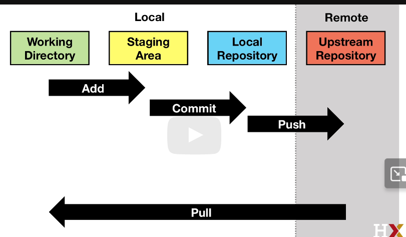
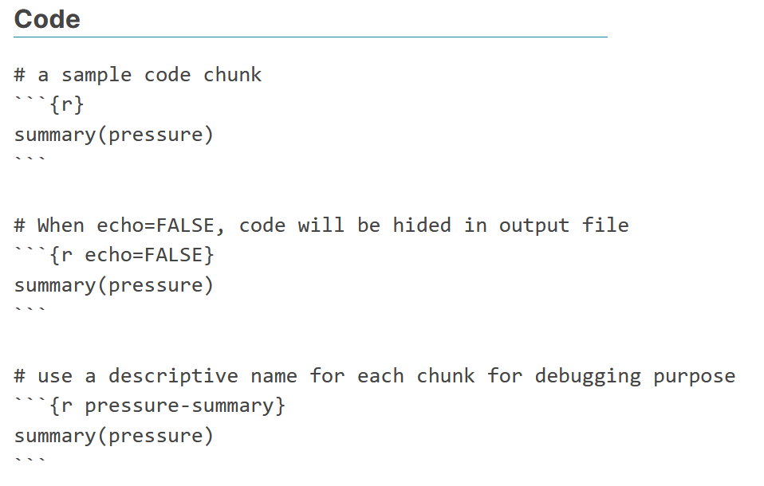
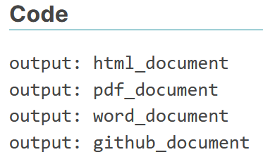
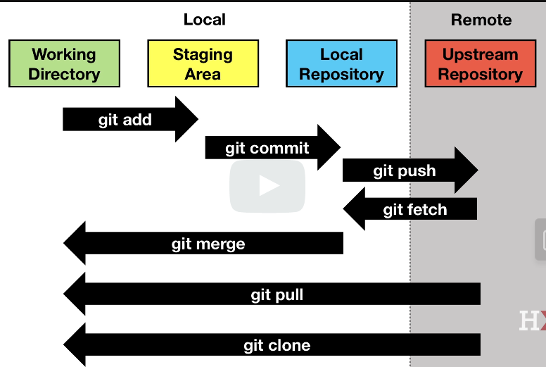
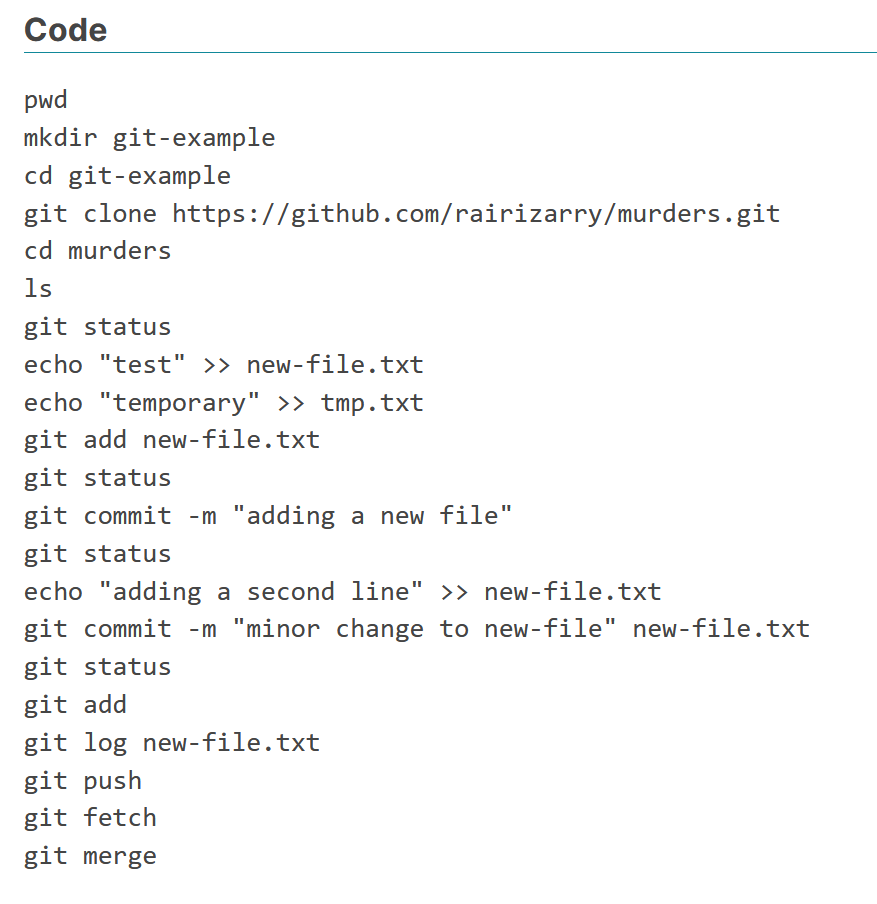
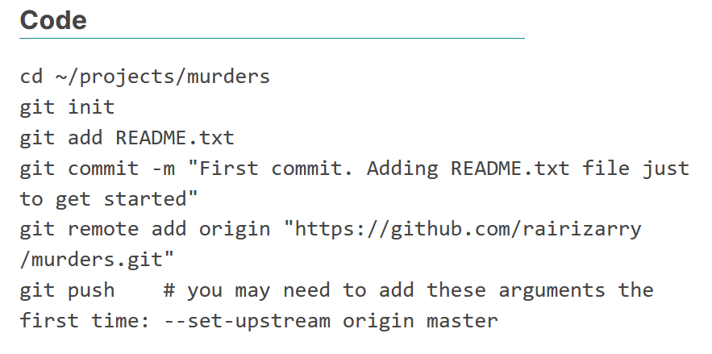

# Section 1 Overview

The Installing Software section walks you through the steps to download and install R, RStudio, git (and git bash on Windows machines), create a GitHub account, and connect RStudio to GitHub.

### Installing Software

-   R: the programming language we use to analyze data

-   RStudio: the integrated desktop environment we use to edit, organize, and test R scripts

-   Git (and Git Bash for Windows): version control system

### Installing R

-   You need to install R before using RStudio, which is an interactive desktop environment.

-   Select base subdirectory in CRAN and click download.

-   Select all default choices in the installation process.

-   We recommend selecting English for language to help you better follow the course.

-   One can try using the R console, but for productivity purposes, we can switch to RStudio.

### Installing RStudio

-   You can download the latest version of RStudio at the [RStudio website External link](https://www.rstudio.com/products/rstudio/download/).

-   The free desktop version is more than enough for this course.

-   Make sure to choose the version for your own operating system.

-   Choose "Yes" for all defaults in the installation process.

### Using RStudio for the first time

-   In Windows, search for Rstudio in "Start"

-   In Mac, choose Rstudio from applications, or use Command+Space to use spotlight search to avoid using the mouse

-   To start a new script: file \> new file \> Rscript (or using key bindings: Ctrl+Shift+N on Windows, and Command+Shift+N on Mac)

-   Key bindings from Rstudio cheatsheet can be located with Help \> cheatsheet \> Rstudio IDE cheatsheet

### Installing packages

-   We will be using **tidyverse** and **dslabs** packages for this course, which do not come preinstalled in base R.

-   Install packages from R console: `install.packages("pkg_name")`

-   Install packages from Rstudio interface: Tools \> install packages (allow autocomplete)

-   Once installed, we can use `library("pkg_name")` to load a package each time we want to use it

-   Check the packages you have installed

-   Good practice: make a script to install all the packages you need for a fresh R

#### Code

```{r}
install.packages("dslabs")  # to install a single package
install.packages(c("tidyverse", "dslabs")） # to install two packages at the same time
installed.packages() # to see the list of all installed packages
```

### Running commands while editing scripts

-   RStudio has many useful features as an R editor, including the ability to test code easily as we write scripts and several autocomplete features.

-   Keyboard shortcuts:

    -   Save a script: Ctrl+S on Windows and Command+S on Mac

    -   Run an entire script:  Ctrl+Shift+Enter on Windows Command+Shift+Return on Mac, or click "Source" on the editor pane

    -   Run a single line of script: Ctrl+Enter on Windows and Command+Return on Mac while the cursor is pointing to that line, or select the chunk and click "run"

    -   Open a new script: Ctrl+Shift+N on Windows and Command+Shift+N on Mac

#### Code

```{r}
library(tidyverse)
```

### Keeping Organized with RStudio Projects

-   RStudio provides a way to keep all the components of a data analysis project organized into one folder and to keep track of information about this project.

-   To start a project, click on File \> New Project \> New repository \> New project \> decide the location of files and give a name to the project, e.g. "my-first-project". This will then generate a Rproj file called my-first-project.Rproj in the folder associated with the project, from which you can double click to start where you last left off.

-   The project name will appear in the upper left corner or the upper right corner, depending on your operating system. When you start an RStudio session with no project, it will display "Project: (None)".

### Installing Git Introduction

-   Git is a version control system, tracking changes and coordinating the editing of code.

-   GitHub is a hosting system for code, which can help with your career profile.

-   Git is most effectively used with Unix, but it can also interface with RStudio.

### Install on Windows

1.  Download Git bash from [https://git-scm.com/ External link](https://git-scm.com/)

2.  When asked to choose the default editor for Git, we recommend choosing nano if you do not already know VIM.

3.  The "git and optional Unix tools from Windows" option will allow you to learn Unix from Rstudio, however, it might interfere with the Windows command line.

4.  Finally, change the Rstudio preference so that you are using Git bash as the terminal (only for Windows user).

### GitHub

-   Sign up for a GitHub account, with a name that is professional, short, and easy to remember

-   Connect to RStudio: global options \> Git/SVM, enter the path to git executables

-   To avoid typing our GitHub password every time, we create a SSH/RSA key automatically through RStudio with the *create RSA key* button.

### GitHub Repositories

To create a new GitHub repository and link it to an RStudio project, follow 2 steps:

Step 1: Initialize a new repo on GitHub by clicking repository \> new \> choose a descriptive name.

Step 2: Connect to RStudio (next video).



## Overview of Section 2: Basic Unix

The Unix section discusses the basics of managing your filesystem from the terminal with Unix commands such as `mv` and `rm`. 

There is a two-part graded comprehension check at the end of the section. Part 2 is only available to Verified learners.

If you get stuck, we encourage you to search the discussion boards for the answer to your issue or ask us for help!


### Unix Commands

-   The commands introduced in this video will help you navigate the file system.

-   You can use the "Tab" key to auto-complete paths, commands, and file names.

```{python}
ls #list dir content
mkdir folder_name #create directory called "folder_name"
rmdir folder_name  #remove an empty directory as long as it is empty
rm -r folder_name  #remove dir that is not empty, "r" stands for recursive
cd: change dir
../ # two dots represents parent dir
. # single dot represents current workingdir 
cd ~/projects # concatenate with forward slashes
cd ../.. # change to two parent layer beyond
cd -  # whatever dir you were before
cd  # return to the home dir
```

### mv and rm: Moving and Removing Files

-   The `mv` command moves files.

-   **[warning]** `mv` will not ask you to confirm the move, and it could potentially overwrite a file.

-   The `rm` command removes files.

-   **[warning]** `rm` is permanent, which is different than throwing a folder in the trash.

```         
mv path-to-file path-to-destination-directory rm filename-1 filename-2 filename-3
```

### less: Looking at a File

-   `less` allows you to quickly look at the content of a file

-   Use `q` to exit the `less` page

-   use the arrows to navigate in the `less` page

```         
less cv.tex
```

### Preparing for a Data Science Project

-   Ideally, files (code, data, output) should be structured and self-contained

-   In a project, we prefer using relative paths (path relative to the default working directory) instead of the full path so that code can run smoothly on other individual's computers.

-   It is good practice to write a README.txt file to introduce the file structure to facilitate collaboration and for your future reference.

```         
########### In terminal ########### cd ~    # move to home directory mkdir projects    # make a new directory called projects cd projects    # move to ~/projects directory mkdir murders    # make new directory called murders inside of projects cd murders    # move to ~/projects/murders/ mkdir data rda    # make two new directories, one is data the other is rda folder ls    # to check if we indeed have one data folder and one rda folder pwd    # check the current working directory mkdir figs    # make a directory called figs to store figures
```

```         
########## In RStudio ######## # pick existing directory as new project getwd()    # to confirm current working directory save()    # save into .rda file, .RData is also fine but less preferred ggsave("figs/barplot.png")    # save a plot generated by ggplot2 to a dir called "figs"
```

# Section 3 Overview

The Reproducible Reports section guides you through how to create data science reports using R Markdown and the knitr package.

### R Markdown

-   R Markdown is a format for *literate programming* documents. Literate programming weaves instructions, documentation and detailed comments in between machine executable code, producing a document that describes the program that is best for human understanding.

    Start an R markdown document by clicking on File \> New File \> the R Markdown

    The output could be HTML, PDF, or Microsoft Word, which can be changed in the header output, e.g. pdf_document / html_document/p\>

```         
# a sample code chunk ```{r} summary(pressure) ```  # When echo=FALSE, code will be hided in output file ```{r echo=FALSE} summary(pressure) ```  # use a descriptive name for each chunk for debugging purpose ```{r pressure-summary} summary(pressure)
```



### knitr

-   The **knitr** package is used to compile R markdown documents.

-   The first time you click the "knit" button on the editor pane a pop-up window will prompt you to install packages, but after that is completed, the button will automatically knit your document.

-   `github_document` gives a .md file, which will give the best presentation on GitHub

### Code

```         
output: html_document  output: pdf_document  output: word_document output: github_document
```

{width="199"}

# Section 4 Overview

In this section on Git and GitHub, you will learn to clone and create version-controlled GitHub repositories using the command line. 



-   Recap: there are four stages: working directory, staging area, local repository, and upstream repository

-   Clone an existing upstream repository (copy repo url from clone button, and type "`git clone <url>`"), and all three local stages are the same as upstream remote.

-   The working directory is the same as the working directory in Rstudio. When we edit files we only change the files in this place.

-   `git status:` tells how the files in the working directory are related to the files in other stages

-   edits in the staging area are not tracked by the version control system by default - we add a file to the staging area by `git add` command

-   `git commit`: to commit files from the staging area to local repository, we need to add a message stating what we are doing by `git commit -m "something"`

-   `git log:` keeps track of all the changes we have made to the local repository

-   `git push`: allows moving from the local repository to upstream repository, only if you have the permission (e.g. if it is yours)

-   `git fetch`: update local repository to  be like the upstream repository, from upstream to local

-   `git merge`: make the updated local sync with the working directory and staging area

-   To change everything in one shot (from upstream to working dir), use `git pull` (equivalent to combining `git fetch` + `git merge`)

### Code

```         
pwd mkdir git-example cd git-example git clone https://github.com/rairizarry/murders.git cd murders ls git status echo "test" >> new-file.txt echo "temporary" >> tmp.txt git add new-file.txt git status git commit -m "adding a new file"  git status echo "adding a second line" >> new-file.txt git commit -m "minor change to new-file" new-file.txt git status git add git log new-file.txt git push git fetch git merge
```



### Creating a GitHub Repository 

-   Recap: two ways to get started, one is cloning an existing repository, the other is initializing our own

-   Create our own project on our computer (independent of Git) on our own machine

-   Create an upstream repo on Github, copy repo's url

-   Make a local git repository: On the local machine, in the project directory, use `git init`. Now git starts tracking everything in the local repo.

-   Now we need to start moving files into our local repo and connect local repo to the upstream remote by  `git remote add origin <url>`

-   **Note:** The first time you push to a new repository, you may also need to use these `git push` options: `git push --set-upstream origin master`. If you need to run these arguments but forget to do so, you will get an error with a reminder.

### Code

```         
cd ~/projects/murders git init git add README.txt git commit -m "First commit. Adding README.txt file just to get started" git remote add origin "https://github.com/rairizarry/murders.git" git push    # you may need to add these arguments the first time: --set-upstream origin master
```



# Section 5 Overview

In Section 5, you will learn additional useful Unix commands, including
arguments, getting help, pipes, and wildcards that are all helpful in
data science.

### Advanced Unix: Arguments

-   Arguments typically are defined using a dash (`-)` or two dashes (`--)` followed by a letter of a word.

```{=html}
<!-- -->
```
-   `r`: recursive. For example, `rm -r <directory-name>`: remove all files, subdirectories, files in subdirectories, subdirectories in subdirectories, etc.

```{=html}
<!-- -->
```
-   Combine arguments: `rm -rf directory-name`

```{=html}
<!-- -->
```
-   `ls -a`: Shows all files in the directories including hidden files (e.g. `.git` file when initializing using `git init`) (a for all).

```{=html}
<!-- -->
```
-   `ls -l`: Returns more information about the files (i.e. `l` for long).

```{=html}
<!-- -->
```
-   `ls -t`: Shows files in chronological order.

```{=html}
<!-- -->
```
-   `ls -r`: Reverses the order of how files are shown.

```{=html}
<!-- -->
```
-   `ls -lart`: Shows more information for all files in reverse chronological order

### Advanced Unix: Getting Help and Pipes 

-   **Getting Help:** Use `man + command name` to get help (e.g. `man ls`). Note that it is not available for Git Bash. For Git Bash, you can use `command -- help` (e.g. `ls --help`).

-   **Pipes:** Pipes the results of a command to the command after the pipe. Similar to the pipe `%>%` in R. For example, `man ls | less` (and its equivalent in Git Bash: `ls --help | less`). Also useful when listing files with many files (e.g `ls -lart | less`).

### Advanced Unix: Wild cards 

-   `*` means any number of any combination of characters. Specifically, to list all html files: `ls *.html` and to remove all html files in a directory: `rm *.html`.

-   `?` means any single character. For example, to erase all files in the  form `file-001.html` with the numbers going from 1 to 999: `rm file-???.html`.

-   Combined wild cards: `rm file-001.*` to remove all files of the name file-001 regardless of suffix.

-   **Warning: Combining rm with the `*` wild card can be dangerous. There are combinations of these commands that will erase your entire file system without asking you for confirmation. Make sure you understand how it works before using this wild card with the rm command.**

### Advanced Unix: Environment Variables and Shells 

-   In Unix, variables are distinguished from other entities by adding a `$` in front. For example, the home directory is stored in `$HOME`.

-   See home directory: echo `$HOME`

-   See them all: `env`

-   See what shell is being used: `echo $SHELL` (most common shell is `bash`)

-   Change environmental variables: (*Don’t actually run this command though!*) `export PATH = /usr/bin/`

### Advanced Unix: Executables, Permissions, and File Types 

-   In Unix, all programs are files. They are called executables. So, `ls`, `mv`, and `git` are all files.

-   To find where these program files are, use which. For example, `which git` would return `/usr/bin/git`.

-   Type `ls /usr/bin` to see several executable files. There are other directories that hold program files (e.g. Application directory for Mac or Program Files directory in Windows).

-   Type `echo $PATH` to see a list of directories separated by "`:"`.

-   Type the full path to run the user-created executables (e.g `./my-ls`).

-   Regular file `-`, directory `d`, executable `x`. 

-   This string also indicates the permission of the file: is it readable? writable? executable? Can other users on the system read the file? Can other users on the system edit the file? Can other users execute if the file is executable?

### Advanced Unix: Commands You Should Learn 

-   Be aware of common commands and know what they do.

-   `open/start` - On the mac `open filename` tries to figure out the right application of the filename and open it with that application. This is a very useful command. On Git Bash, you can try `start filename`. Try opening an `R` or `Rmd` file with `open` or `start`: it should open with RStudio.

-   `nano` - A bare-bones text editor.

-   `ln` - create a symbolic link. We do not recommend its use, but you should be familiar with it.

-   `tar` - archive files and subdirectories of a directory into one file.

-   `ssh` - connect to another computer.

-   `grep` - search for patterns in a file.

-   `awk/sed` - These are two very powerful commands that permit you to find specific strings in files and change them.
